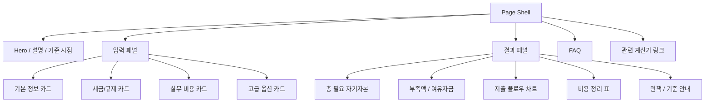

# Home Buying Funds Calculator Implementation Plan

> **For agentic workers:** REQUIRED: Use superpowers:subagent-driven-development (if subagents available) or superpowers:executing-plans to implement this plan. Steps use checkbox (`- [ ]`) syntax for tracking.

**Goal:** 아파트 매수 필요자금 계산기의 화면, 계산 구조, SEO, 단계별 구현 범위를 고정해 바로 개발에 착수할 수 있게 한다.

**Architecture:** 서버 페이지 셸은 기존 Tool 패턴을 그대로 따르고, 실제 화면과 상호작용은 `components/tools/home-buying-funds-calculator/*` 아래 클라이언트 루트에서 처리한다. 계산 로직은 `lib/tools/home-buying-funds-calculator/*` 아래 순수 함수로 분리하고, URL 공유 상태는 `nuqs`로 관리하며, 결과 표와 플로우 차트는 동일한 정규화 결과 모델을 공유한다.

**Tech Stack:** Next.js App Router, React 19, TypeScript, Tailwind CSS, shadcn/ui, nuqs, 기존 `lib/tools/*` SEO 파이프라인

---

## 참고 문서

- 기준 PRD: `docs/plans/2026-03-25-home-buying-funds-calculator-prd.md`
- 신규 Tool 생성 규칙: `docs/app-page/create-tools-page.md`
- 기존 구조 참고:
  - `docs/app-page/tools-page-loan-structure.md`
  - `docs/app-page/tools-page-saving-structure.md`

## 구현 원칙

1. 기존 Tool 페이지 패턴을 깨지 않는다.
2. 법정 계산식은 순수 함수로 분리한다.
3. 자동 계산과 직접 입력은 동일한 결과 모델 위에서 동작해야 한다.
4. 설명 UI, 결과 표, 플로우 차트는 서로 다른 데이터를 중복으로 가지지 않는다.
5. SEO 소스 오브 트루스는 `lib/tools/tool-config.ts` 하나로 유지한다.

## Chunk 1: 화면 구조와 UX 설계

### 1. 페이지 정보 구조

페이지는 단일 라우트 `/tools/home-buying-funds-calculator`로 구현한다.

화면은 아래 순서로 배치한다.

1. 상단 breadcrumb + ToolSwitcher
2. H1, 설명 문단, 기준 시점 안내
3. 입력/결과 2단 레이아웃
4. 결과 하단 상세 표와 플로우 차트
5. FAQ
6. 관련 계산기 링크

### 2. 데스크톱 레이아웃

데스크톱에서는 `좌측 입력 / 우측 결과` 2열 구조를 사용한다.

- 좌측: 입력 카드 묶음, `계산하기`, `초기화`
- 우측: 요약 카드, 부족액/여유자금 카드, 지출 플로우 차트, 비용 표 요약

권장 비율:

- 좌측 5
- 우측 7

UX 이유:

- 입력이 많아도 결과가 항상 보인다.
- 자동 계산/직접 입력 전환이 발생해도 결과 비교가 쉽다.
- 기존 계산기 페이지보다 복잡도가 높아 상단-하단 단일 컬럼보다 정보 분리가 낫다.

### 3. 모바일 레이아웃

모바일에서는 전부 세로 스택으로 배치한다.

순서:

1. 소개
2. 입력 카드 묶음
3. sticky 하단 CTA bar
4. 요약 카드
5. 부족액/여유자금
6. 플로우 차트
7. 비용 표
8. FAQ

모바일 원칙:

- 입력 그룹은 accordion/collapsible 구조
- 결과는 `계산하기` 이후 펼쳐짐
- 긴 설명은 툴팁보다 dialog/bottom sheet 우선

### 4. 입력 그룹 설계

입력 영역은 4개 카드로 나눈다.

1. `기본 정보`
2. `세금/규제 정보`
3. `실무 비용`
4. `고급 옵션`

각 카드 공통 규칙:

- 카드 상단에 제목, 한 줄 설명, 필수/선택 표시
- 자동 계산 필드는 정보 아이콘 노출
- 수동 입력 가능 필드는 `자동 계산 / 직접 입력` 토글 제공
- 직접 입력 전환 시 경고 문구 표시

### 5. 결과 영역 설계

결과 영역은 아래 순서로 구성한다.

1. `총 필요 자기자본` 메인 카드
2. `최소 필요 현금 / 권장 필요 현금 / 대출 제외 현금 부담액` 서브 카드
3. `현재 보유 현금 대비 부족액/여유자금` 카드
4. `지출 흐름 플로우 차트`
5. `항목별 정리 표`
6. `면책 및 계산 기준 안내`

### 6. 정보 아이콘, 툴팁, 모달 UX

정보 설명 UI는 세 단계로 나눈다.

- 짧은 정의: tooltip
- 정책/예외 설명: dialog
- 모바일 긴 설명: bottom sheet 또는 dialog

모달에는 아래 내용을 포함한다.

1. 항목 정의
2. 왜 필요한지
3. 계산 기준
4. 예외 케이스
5. 직접 입력이 필요한 사례
6. 기준 출처 또는 기준 유형

### 7. 자동 계산과 직접 입력 전환 UX

직접 입력 전환은 아래 항목에만 1차 MVP에서 허용한다.

- 취득세
- 지방교육세
- 농어촌특별세
- 등록면허세
- 국민주택채권 실부담액
- 중개보수
- 법무사 비용
- 관리비예치금
- 인테리어/이사/청소 등 시세성 항목

전환 규칙:

1. 기본은 자동 계산
2. 사용자가 토글을 켜면 수동 입력 필드 노출
3. 수동 입력값은 URL 상태와 결과 표에 모두 반영
4. 결과 표 `계산 방식` 컬럼에 `수동` 또는 `자동+수정` 표시

### 8. 플로우 차트 UX

플로우 차트는 단순 장식이 아니라 결과 해석 도구로 사용한다.

표현 항목:

- 계약금
- 계약 직후 비용
- 대출 준비
- 잔금일
- 세금/등기
- 입주 준비

상호작용:

- 각 노드 클릭 시 대응하는 표 항목 하이라이트
- 선택 비용은 점선 연결
- 노드 금액은 단계 합계 기준

### 9. 상태 정의

화면은 아래 상태를 명확히 가진다.

- 초기 상태
- 입력 중 상태
- 계산 완료 상태
- 직접 입력 덮어쓰기 상태
- 일부 조건 미지원 상태
- 설명 모달 열림 상태

### 10. 화면 구조 다이어그램



## Chunk 2: 디렉토리 구조와 파일 정의

### 1. 생성 파일

```text
app/
  tools/
    home-buying-funds-calculator/
      page.tsx

components/
  tools/
    home-buying-funds-calculator/
      index.ts
      HomeBuyingFundsCalculatorForm.tsx
      HomeBuyingFundsCalculatorFAQ.tsx
      constants.ts
      accessibility.ts
      hooks/
        parsers.ts
        useHomeBuyingFundsCalculator.ts
      sections/
        HomeBuyingInputSection.tsx
        HomeBuyingResultSection.tsx
      components/
        BasicInfoCard.tsx
        TaxRuleCard.tsx
        PracticalCostCard.tsx
        AdvancedOptionsCard.tsx
        CostSummaryCards.tsx
        CashGapCard.tsx
        CostBreakdownTable.tsx
        SpendingFlowChart.tsx
        FieldInfoDialog.tsx
        AutoManualToggle.tsx
        ShareButton.tsx

lib/
  tools/
    home-buying-funds-calculator/
      index.ts
      types.ts
      presets.ts
      taxes.ts
      practical-costs.ts
      calculation.ts
```

### 2. 수정 파일

- `lib/tools/tool-config.ts`
- `app/tools/page.tsx` 수정 불필요 예상
- `lib/seo/sitemap.ts` 수정 불필요 예상
- `lib/tools/index.ts` 수정 불필요 예상
- `public/og-images/...` 신규 이미지 경로 필요 시 추가

### 3. 파일별 책임

| 파일 | 책임 |
| --- | --- |
| `app/tools/home-buying-funds-calculator/page.tsx` | metadata, JSON-LD, breadcrumb, ToolSwitcher, 루트 폼 조립 |
| `HomeBuyingFundsCalculatorForm.tsx` | 페이지 내부 전체 조립, FAQ/관련 도구 연결 |
| `hooks/parsers.ts` | URL query key, 자동/수동 모드, 수동 금액 필드 정의 |
| `hooks/useHomeBuyingFundsCalculator.ts` | 입력 상태, 계산 실행, 결과 모델 생성, 공유 상태 관리 |
| `sections/HomeBuyingInputSection.tsx` | 입력 카드 4개 조립 |
| `sections/HomeBuyingResultSection.tsx` | 요약 카드, 플로우 차트, 비용 표 조립 |
| `components/BasicInfoCard.tsx` | 매매가, 대출금, 보유 현금, 계약금 등 기본 입력 |
| `components/TaxRuleCard.tsx` | 조정대상지역, 생애최초, 주택 수, 시가표준액 등 |
| `components/PracticalCostCard.tsx` | 중개보수, 법무사, 청소, 이사, 인테리어 프리셋 |
| `components/AdvancedOptionsCard.tsx` | 방공제, MCG, 예비비, 직접 입력 전환 |
| `components/CostSummaryCards.tsx` | 핵심 합계 카드 |
| `components/CashGapCard.tsx` | 부족액/여유자금 카드 |
| `components/CostBreakdownTable.tsx` | 항목별 정리 표 |
| `components/SpendingFlowChart.tsx` | 단계별 지출 시각화 |
| `components/FieldInfoDialog.tsx` | 법정/정책 항목 설명 모달 |
| `components/AutoManualToggle.tsx` | 자동 계산과 직접 입력 전환 공통 UI |
| `lib/tools/home-buying-funds-calculator/types.ts` | 입력, 결과, breakdown item, flow node 타입 |
| `lib/tools/home-buying-funds-calculator/taxes.ts` | 취득세, 지방교육세, 농특세, 등록면허세, 인지세 계산 |
| `lib/tools/home-buying-funds-calculator/practical-costs.ts` | 청소/이사/인테리어 등 프리셋 계산 |
| `lib/tools/home-buying-funds-calculator/calculation.ts` | 전체 합산, 결과 표/플로우 차트용 정규화 모델 생성 |
| `lib/tools/home-buying-funds-calculator/presets.ts` | 지역/프리셋/기본 비율 상수 |

### 4. 상태 모델 설계

`parsers.ts`에서 최소 아래 상태를 URL에 포함한다.

- 매매가, 대출금, 보유 현금
- 지역, 주택 수, 전용 85㎡ 초과 여부
- 조정대상지역 여부
- 생애최초 여부
- 일시적 2주택 여부
- 시가표준액
- 계약금 비율 또는 금액
- 실무 비용 프리셋값
- 자동/직접 입력 모드 토글
- 직접 입력 금액 값

중요 규칙:

1. 공유 링크를 위해 직접 입력값도 URL에 포함해야 한다.
2. 모달 open/close 같은 UI 상태는 URL에 넣지 않는다.
3. 결과 객체 자체는 저장하지 않고 항상 계산으로 재생성한다.

### 5. 정규화 결과 모델

모든 결과 UI는 아래 공통 결과 모델을 기준으로 렌더링한다.

```ts
interface CostBreakdownItem {
  id: string
  stage: 'contract' | 'loan' | 'balance' | 'registration' | 'move'
  category: 'public' | 'loan-registration' | 'practical' | 'other'
  label: string
  amount: number
  calculationMode: 'auto' | 'auto-adjusted' | 'manual'
  confidence: 'high' | 'medium' | 'low'
  note?: string
  formula?: string
}
```

이 모델을 기준으로 아래를 모두 렌더링한다.

- 요약 카드
- 비용 정리 표
- 플로우 차트 단계 합계
- 직접 입력 배지

## Chunk 3: SEO 구현 정의

### 1. Tool 등록

`lib/tools/tool-config.ts`에 `home-buying-funds-calculator` 엔트리를 추가한다.

권장 메타:

- `id`: `home-buying-funds-calculator`
- `name`: `주택 매수 필요자금 계산기`
- `shortName`: `주택 매수 필요자금 계산기`
- `breadcrumbLabel`: `매수 필요자금 계산기`
- `category`: `calculator`
- `applicationCategory`: `FinanceApplication`

### 2. 메타데이터 방향

페이지는 기존 패턴대로 아래 흐름을 따른다.

1. `generateToolMetadata('home-buying-funds-calculator')`
2. `getToolStructuredDataArray('home-buying-funds-calculator')`
3. `Breadcrumb`
4. `ToolSwitcher`

### 3. 온페이지 SEO 구조

페이지 텍스트 구조는 아래 H 계층을 권장한다.

- `H1`: 주택 매수 필요자금 계산기
- `H2`: 집값과 대출로 필요한 자기자본 계산하기
- `H2`: 자동 계산되는 세금과 부대비용
- `H2`: 직접 입력이 필요한 예외 항목
- `H2`: 결과 표 읽는 방법
- `H2`: 아파트 매수 지출 흐름
- `H2`: 자주 묻는 질문

### 4. 핵심 키워드 방향

권장 키워드 축:

- 주택 매수 필요자금 계산기
- 집 살 때 필요한 돈 계산기
- 아파트 매수 부대비용 계산기
- 취득세 중개보수 계산기
- 집 살 때 자기자본 계산
- 부동산 매수 비용 계산

### 5. 구조화 데이터

기존 Tool 파이프라인을 유지한다.

- `WebPage`
- `BreadcrumbList`
- `WebApplication`
- `FAQPage`
- `HowTo`

추가 원칙:

1. 별도 커스텀 schema를 도입하지 않는다.
2. FAQ와 HowTo는 반드시 `tool-config`에 넣는다.
3. FAQ는 법적 확정 표현보다 참고용 안내 문구를 유지한다.

### 6. 콘텐츠 SEO 체크포인트

- 제목과 설명에 `주택 매수`, `필요자금`, `부대비용`, `자기자본` 포함
- 도구 소개 문단에서 사용자 의도형 문장 사용
- FAQ 6개 이상 작성
- HowTo 5단계 이상 작성
- OG 이미지 별도 생성 권장
- 결과 영역 아래 면책 문구 포함

### 7. sitemap 반영

메인 Tool 페이지는 `tool-config` 등록만으로 `collectToolEntries()`에 자동 반영된다.

별도 수정이 필요한 경우:

- 서브페이지를 만들 때만 `lib/seo/sitemap.ts` 수동 추가

## Chunk 4: 페이즈별 개발 체크리스트

### Phase 0: Tool 등록과 페이지 셸

- [ ] `lib/tools/tool-config.ts`에 Tool 엔트리 추가
- [ ] FAQ, HowTo, keywords, ogImage 경로 정의
- [ ] `app/tools/home-buying-funds-calculator/page.tsx` 생성
- [ ] `components/tools/home-buying-funds-calculator/index.ts` 생성
- [ ] `HomeBuyingFundsCalculatorForm.tsx` 기본 셸 생성
- [ ] breadcrumb, ToolSwitcher, JsonLdMultiple 연결

### Phase 1: 도메인 타입과 계산 코어

- [ ] `lib/tools/home-buying-funds-calculator/types.ts` 생성
- [ ] `presets.ts`에 지역/기본 프리셋 정의
- [ ] `taxes.ts`에 법정 계산식 구현
- [ ] `practical-costs.ts`에 프리셋 계산 구현
- [ ] `calculation.ts`에 전체 합산 함수 구현
- [ ] breakdown item과 flow node 정규화 함수 구현

### Phase 2: URL 상태와 입력 UI

- [ ] `hooks/parsers.ts` 생성
- [ ] `hooks/useHomeBuyingFundsCalculator.ts` 생성
- [ ] 기본 입력 카드 구현
- [ ] 세금/규제 카드 구현
- [ ] 실무 비용 카드 구현
- [ ] 고급 옵션 카드 구현
- [ ] 자동/직접 입력 토글 연결
- [ ] 정보 아이콘과 설명 데이터 연결

### Phase 3: 결과 UI

- [ ] 요약 카드 구현
- [ ] 부족액/여유자금 카드 구현
- [ ] 비용 정리 표 구현
- [ ] 플로우 차트 구현
- [ ] 직접 입력 배지 및 계산 방식 배지 구현
- [ ] 공유 버튼 연결

### Phase 4: 설명 UI와 콘텐츠

- [ ] `FieldInfoDialog.tsx` 구현
- [ ] 법정 항목 설명 사전 작성
- [ ] `HomeBuyingFundsCalculatorFAQ.tsx` 구현
- [ ] 기준 시점 및 면책 문구 추가
- [ ] 관련 계산기 링크 연결

### Phase 5: SEO와 마감 점검

- [ ] tool-config의 title/description/keywords 최종 점검
- [ ] FAQ/HowTo 구조화 데이터 실제 렌더링 확인
- [ ] OG 이미지 추가 또는 기본 OG 결정
- [ ] `/tools` 목록 노출 확인
- [ ] sitemap 자동 반영 확인
- [ ] 모바일/데스크톱 반응형 검수

## 검증 체크리스트

### 명령 검증

- [ ] `pnpm type-check`
- [ ] `pnpm lint:check`
- [ ] `pnpm build`

### 수동 QA

- [ ] 기본 입력만으로 계산 가능
- [ ] 대출금 0원 케이스 정상 동작
- [ ] 직접 입력 전환 시 합계와 표가 함께 변경
- [ ] 공유 URL 복원 가능
- [ ] 모바일에서 설명 모달/시트 가독성 확보
- [ ] 플로우 차트와 표 항목 금액 합계 일치
- [ ] FAQ와 HowTo JSON-LD 노출 확인

## 현재 레포 기준 리스크

1. 현재 `package.json`에는 전용 `test` 스크립트가 없다.
2. 따라서 1차 검증은 `type-check`, `lint:check`, `build`, 수동 QA 중심으로 잡는 것이 안전하다.
3. 법정 수치 업데이트는 코드보다 `tool-config`와 설명 문구 업데이트 누락이 더 큰 리스크다.
4. 자동 계산과 직접 입력을 혼합하면 상태 키가 많아지므로 `parsers.ts` 설계가 중요하다.

## 결론

이 기능은 단순 계산기보다 `도메인 규칙`, `설명 UX`, `결과 해석 UI`, `SEO 콘텐츠`가 함께 움직이는 Tool이다. 구현은 `페이지 셸 -> 계산 코어 -> URL 상태 -> 입력 UI -> 결과 UI -> SEO/설명 마감` 순서로 진행하는 것이 가장 안전하다.
