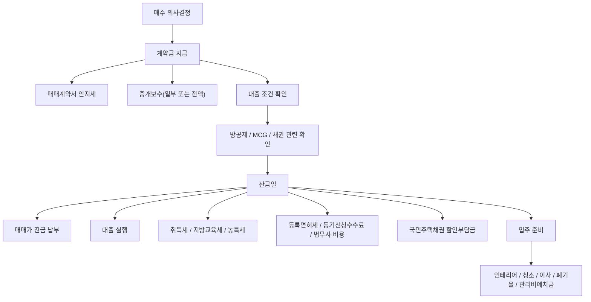

# PRD: 주택 매수 필요자금 계산기 + 결과 정리표

- 문서 상태: Draft v1
- 작성일: 2026-03-25
- 대상 서비스: Zento Tools
- 대상 경로(가안): `/tools/home-buying-funds-calculator`
- 문서 목적: 집을 살 때 필요한 자기자본과 부대비용을 한 번에 계산하고, 결과를 항목별 표로 정리해 보여주는 계산기 요구사항을 고정한다.

## 1. 문서 범위와 전제

이 문서는 우선 다음 전제로 작성한다.

- 대한민국 기준
- 아파트 매수 기준
- 개인 매수인 기준
- 매수 시점의 필요자금 계산이 목적
- 실제 세무/대출 심사 확정 도구가 아니라 참고용 계산기

정책과 시세는 변동될 수 있으므로 구현 직전 재검증이 필요하다. 특히 시장가 기반 항목은 정확하지 않을 수 있다.

다음 항목은 정책과 시세 변동 가능성이 높아 입력값 또는 안내문으로 처리한다.

- 조정대상지역 여부
- 생애최초 감면 여부
- 일시적 2주택 여부
- 국민주택채권 할인율
- 법무사 보수 총액
- 인테리어/이사/청소 등 시장가 비용

## 2. 배경    

집을 살 때 사용자는 보통 `집값 - 대출금 = 내 돈` 정도로만 생각하기 쉽다. 하지만 실제로는 취득세, 지방교육세, 농어촌특별세, 등록면허세, 중개보수, 법무사 비용, 국민주택채권 할인부담금, 인지세, 방공제, 관리비예치금, 인테리어, 이사, 청소, 폐기물 처리 등 항목이 동시에 발생한다.

문제는 다음과 같다.

1. 공적 비용과 실무 비용이 서로 다른 기준으로 계산된다.
2. 일부 항목은 자동 계산이 가능하지만, 일부는 시세 변동이 커서 사용자 보정이 필요하다.
3. 대출을 얼마나 받을지에 따라 실제 필요 자기자본이 크게 달라진다.
4. 사용자는 총액뿐 아니라 `왜 이 금액이 필요한지`를 항목별로 이해하고 싶어 한다.

## 3. 목표

1. 사용자가 `집값`, `대출금액`만 넣어도 최소 필요 자기자본의 윤곽을 볼 수 있어야 한다.
2. 공적 비용은 가능한 한 자동 계산한다.
3. 실무 비용은 프리셋과 수동 입력을 함께 제공한다.
4. 결과를 `합계 카드 + 항목별 정리 표`로 보여준다.
5. 어떤 항목이 자동 계산값인지, 어떤 항목이 추정값인지 명확히 구분한다.
6. 빠뜨리기 쉬운 항목을 체크리스트처럼 안내한다.
7. 사용자가 현재 보유 현금을 입력하면 `부족액 / 여유자금`까지 보여준다.
8. 법정/정책성 수치에는 툴팁 또는 상세 설명 모달을 제공한다.
9. 자동 계산이 불가능한 예외 케이스는 직접 입력으로 전환할 수 있게 한다.
10. 아파트 매수자의 지출 흐름을 플로우 차트 형태로 시각화한다.

## 4. 비목표

1. 실제 세무 신고 또는 대출 승인 가능성을 확정하지 않는다.
2. 모든 지자체의 예외 규정과 모든 금융기관의 내부 심사 기준을 완전 재현하지 않는다.
3. 법무사 보수, 국민주택채권 할인율, 인테리어 견적을 실시간 외부 API로 확정하지 않는다.
4. 빌라, 오피스텔, 상가, 분양권, 입주권까지 한 번에 지원하지 않는다.

## 5. 핵심 사용자

- 생애최초 또는 일반 실수요자
- 아파트 매수 전에 자기자본 부족 여부를 확인하려는 사용자
- 부동산/대출 상담 전에 예산 범위를 먼저 잡고 싶은 사용자
- 가족/배우자와 항목별 비용을 같이 검토하려는 사용자

## 6. 제품 포지셔닝

이 도구는 `매수 가능 여부 확정 도구`가 아니라 `필요자금 계획 도구`다.

핵심 메시지는 다음과 같다.

- 집값만 보면 부족하다.
- 대출을 받더라도 세금과 부대비용 때문에 추가 현금이 필요하다.
- 자동 계산값과 추정값을 분리해서 봐야 한다.

## 7. 추천 접근 방식

세 가지 접근이 가능하다.

1. 단순형: `집값`, `대출금`, `몇 개 비용`만 합산
2. 권장형: 공적 비용 자동 계산 + 실무 비용 프리셋/수동 입력 + 결과 표 제공
3. 고급형: 방공제, MCG, 생애최초, 일시적 2주택, 전자등기까지 세밀 반영

권장안은 `2번을 기본`, `3번 일부를 고급 옵션`으로 포함하는 방식이다.

이유는 다음과 같다.

1. 실제 사용자 가치가 가장 큰 건 `총 필요 현금`과 `항목별 근거`다.
2. 법정 계산식은 자동화하되, 시장가 항목은 직접 수정이 가능해야 현실적이다.
3. 고급 규정은 초반부터 전부 노출하면 사용성이 떨어진다.

## 8. 핵심 산식

### 8.1 최종 핵심 지표

```text
잔금 기준 필요 현금
= (매매가 - 대출금액)
+ 공적 세금/등기 비용
+ 중개/등기/대출 부대비용

입주 준비 예산
= 인테리어
+ 이사비
+ 청소비
+ 폐기물 처리비
+ 관리비예치금
+ 기타 선택 비용

총 필요 자기자본
= 잔금 기준 필요 현금 + 입주 준비 예산
```

### 8.2 화면에서 보여줄 합계

- `최소 필요 현금`: 입주 준비 예산을 제외한 보수적 값
- `권장 필요 현금`: 선택한 실무 비용까지 포함한 값
- `집값 대비 자기자본 비율`
- `대출 제외 후 순수 현금 부담액`

### 8.3 보유 현금 비교

옵션 입력으로 `현재 보유 현금`을 받으면 다음 값도 함께 보여준다.

```text
부족액 또는 여유자금
= 현재 보유 현금 - 총 필요 자기자본
```

표시 규칙:

- 0 이상이면 `여유자금`
- 0 미만이면 `부족액`
- `계약금 시점`, `잔금 시점`으로 나눠 보여주면 더 좋다.

## 9. 입력 구조

입력은 `기본 입력`, `세금/규제 입력`, `실무 비용 입력`, `고급 입력`으로 나눈다.

### 9.1 기본 입력

- 매매가
- 희망 대출금액
- 현재 보유 현금
- 주택 소재 지역
- 전용면적 85㎡ 초과 여부
- 시가표준액 또는 취득세 과표
- 소유 주택 수
- 계약금 비율 또는 계약금 금액

### 9.2 세금/규제 입력

- 조정대상지역 여부
- 생애최초 주택 구입 여부
- 일시적 2주택 여부
- 매매계약서 인지세 매수인 부담 비율
- 대출 인지세 매수인 부담 비율
- 등기신청 방식: 방문 / 전자

### 9.3 실무 비용 입력

- 중개보수 협의요율
- 법무사 예상비용
- 국민주택채권 할인율 또는 예상 실부담액
- 인테리어 범위: 없음 / 부분 / 중간 / 전체
- 이사 유형: 일반 / 반포장 / 포장
- 입주청소 여부
- 폐기물 처리 여부
- 관리비예치금 직접 입력

### 9.4 고급 입력

- 방공제 지역 구분
- 적용방수
- 구입자금보증(MCG) 사용 여부
- 보증료율
- 대출 실행 시 근저당 관련 부대비용 직접 입력
- 예비비 비율

### 9.5 입력 UX 공통 규칙

모든 입력 필드는 아래 공통 규칙을 따른다.

1. 법정 계산식 또는 정책 기준에 따라 자동 계산되는 필드는 `정보 아이콘`을 둔다.
2. 정보 아이콘 클릭 시 짧은 설명은 `툴팁`, 긴 설명은 `상세 모달`로 보여준다.
3. 자동 계산 필드 중 예외가 많은 항목은 `자동 계산 / 직접 입력` 전환 토글을 둔다.
4. 직접 입력 모드로 전환하면 자동 계산식은 비활성화하고, 결과 표에 `사용자 직접 입력값`이라고 명시한다.
5. 사용자의 조건이 현재 로직으로 커버되지 않으면 `현재 조건은 자동 계산 대상이 아니므로 직접 입력해 주세요` 안내를 노출한다.

## 10. 비용 항목 분류

### 10.1 자동 계산 우선 항목

- 취득세
- 취득세분 지방교육세
- 농어촌특별세
- 등록면허세
- 등록면허세분 지방교육세
- 등기신청수수료
- 인지세
- 부동산 중개보수
- 방공제 관련 참고값

### 10.2 자동 계산 + 수동 보정 항목

- 국민주택채권 매입액
- 국민주택채권 할인부담금
- 대출 인지세
- 입주청소
- 도배
- 장판
- 이사비

### 10.3 수동 입력 권장 항목

- 법무사 총비용
- 전체 인테리어 총액
- 관리비예치금
- 장기수선충당금 정산 반영액
- 에어컨 이전설치
- 커튼/블라인드
- 조명 교체
- 도어락 교체
- 가전/가구 신규 구입

## 11. 비용별 계산 기준 정리

### 11.1 공적 비용

| 항목 | 기본 계산식 | 조건 |
| --- | --- | --- |
| 취득세 | 1주택 6억 이하 `매매가 × 1%` | 1주택 비규제 기준 |
| 취득세 | 1주택 6억 초과 9억 이하 `매매가 × (((매매가 × 2 / 3억원) - 3)%)` | 선형 비례 구간 |
| 취득세 | 1주택 9억 초과 `매매가 × 3%` | 1주택 비규제 기준 |
| 취득세 중과 | `매매가 × 8%` 또는 `12%` | 조정대상지역 여부, 주택 수에 따라 분기 |
| 취득세분 지방교육세 | 일반적으로 `취득세의 10%` 수준 | 중과/감면은 별도 분기 필요 |
| 농어촌특별세 | ETAX 분기표 기반 별도 계산 | 전용 85㎡ 초과 여부 중요 |
| 등록면허세 | `매매가 × (취득세율 × 50%)` | 주택 유상 소유권이전등기 기준 |
| 등록면허세분 지방교육세 | `등록면허세 × 20%` | 등록면허세 연동 |
| 등기신청수수료 | 방문 기준 `부동산 1건당 18,000원` | 전자신청 시 별도 |
| 매매계약서 인지세 | 구간 테이블 적용 | 1천만 초과부터 과세 |
| 대출 인지세 | 구간 테이블 적용 후 매수인 부담비율 반영 | 대출금 구간 반영 |

### 11.2 중개/등기/대출 관련 비용

| 항목 | 기본 계산식/방법 | 메모 |
| --- | --- | --- |
| 부동산 중개보수 | `매매가 × 협의요율`, 단 상한요율 이내 | 매수인/매도인 각각 부담 |
| 법무사 비용 | 보수표 기반이나 총액은 수동 보정 | 기본보수 + 가산보수 + 실비 + VAT |
| 국민주택채권 매입액 | `시가표준액 × 지역별 매입기준` | 공공 계산기 기준 반영 필요 |
| 국민주택채권 실부담액 | `채권 매입액 × 할인율` | 당일 할인율 변동 |
| 근저당 관련 채권 할인 | 대출 실행 시 추가 발생 가능 | 은행/설정액에 따라 다름 |
| MCG 보증료 | `보증금액 × 보증료율` | 사용 시에만 반영 |

### 11.3 입주 준비 비용

| 항목 | 권장 계산 방식 | 메모 |
| --- | --- | --- |
| 인테리어 | 범위 프리셋 + 수동 보정 | 부분/중간/전체 |
| 도배 | `평수 × 벽지단가 + 인건비` | 합지/실크 분기 |
| 장판 | `평수 × 자재등급 단가` | 철거 여부 반영 |
| 줄눈 | 공간별 단가 합산 | 욕실/현관/주방 체크 |
| 탄성코트 | 공간별 단가 합산 | 베란다 수 반영 |
| 이사비 | `기본요금 + 거리 + 사다리차 + 성수기 가산` | 포장/반포장/일반 |
| 입주청소 | `공급평수 × 평당 단가` | 오염도 옵션 추가 |
| 폐기물 처리 | `지역 수수료표 × 품목/중량` | 전국 공통 자동화는 부정확 |
| 관리비예치금 | 직접 입력 | 단지별 상이 |
| 예비비 | `(인테리어 + 수리비) × 기본 10%` | 사용자 수정 가능 |

## 12. 세부 규칙 테이블

### 12.1 중개보수 상한요율

주택 매매 기준 상한요율은 다음을 기본값으로 둔다.

| 거래금액 | 상한요율 | 한도액 |
| --- | --- | --- |
| 5천만 원 미만 | 0.6% | 25만 원 |
| 5천만 원 이상 ~ 2억 원 미만 | 0.5% | 80만 원 |
| 2억 원 이상 ~ 9억 원 미만 | 0.4% | 상한요율 이내 협의 |
| 9억 원 이상 ~ 12억 원 미만 | 0.5% | 상한요율 이내 협의 |
| 12억 원 이상 ~ 15억 원 미만 | 0.6% | 상한요율 이내 협의 |
| 15억 원 이상 | 0.7% | 상한요율 이내 협의 |

### 12.2 인지세 구간

부동산 소유권 이전 계약서 기준으로 다음 구간 테이블을 사용한다.

| 계약서 금액 | 인지세 |
| --- | --- |
| 1천만 원 이하 | 비과세 |
| 1천만 원 초과 ~ 3천만 원 이하 | 2만 원 |
| 3천만 원 초과 ~ 5천만 원 이하 | 4만 원 |
| 5천만 원 초과 ~ 1억 원 이하 | 7만 원 |
| 1억 원 초과 ~ 10억 원 이하 | 15만 원 |
| 10억 원 초과 | 35만 원 |

### 12.3 방공제 관련 설계 포인트

방공제는 직접 세금이 아니라 `대출 가능액`에 영향을 주는 요소이므로 고급 옵션으로 둔다.

화면 설계 원칙은 다음과 같다.

1. 사용자가 대출을 쓰지 않으면 기본 숨김
2. 대출을 쓰면 `방공제 적용 여부`를 선택하게 함
3. `지역구분`, `적용방수`, `MCG 사용 여부`를 펼침 입력으로 제공
4. 결과표에는 `대출 가능액 참고 조정항목`으로 별도 표시

### 12.4 설명 UI와 직접 입력 전환 대상

다음 항목은 기본적으로 설명 UI를 붙이고, 필요하면 직접 입력 전환을 허용한다.

| 항목 | 기본 UI | 설명 방식 | 직접 입력 허용 여부 |
| --- | --- | --- | --- |
| 조정대상지역 여부 | 토글 + 정보 아이콘 | 모달 | 아니오 |
| 생애최초 감면 | 체크박스 + 정보 아이콘 | 모달 | 아니오 |
| 전용면적 85㎡ 초과 여부 | 체크박스 + 정보 아이콘 | 툴팁 | 아니오 |
| 시가표준액 | 입력 필드 + 정보 아이콘 | 모달 | 예 |
| 취득세 | 자동 계산 출력값 + 정보 아이콘 | 모달 | 예 |
| 취득세분 지방교육세 | 자동 계산 출력값 + 정보 아이콘 | 툴팁 | 예 |
| 농어촌특별세 | 자동 계산 출력값 + 정보 아이콘 | 모달 | 예 |
| 등록면허세 | 자동 계산 출력값 + 정보 아이콘 | 툴팁 | 예 |
| 방공제 | 고급 입력 + 정보 아이콘 | 모달 | 예 |
| 국민주택채권 | 자동 계산 + 정보 아이콘 | 모달 | 예 |
| 중개보수 | 자동 계산 + 정보 아이콘 | 툴팁 | 예 |
| 법무사 비용 | 수동 입력 필드 + 정보 아이콘 | 모달 | 예 |

모달에 들어갈 핵심 설명 항목은 다음을 기본으로 한다.

1. 이 수치가 왜 필요한가
2. 어떤 법/공공 기준을 따르는가
3. 어떤 조건에서 달라지는가
4. 자동 계산이 어려운 예외는 무엇인가
5. 직접 입력이 필요한 대표 사례는 무엇인가

대표 예외 안내 예시는 다음과 같다.

- 일시적 2주택
- 생애최초 감면 특례
- 조정대상지역 정책 변경
- 시가표준액 미확정 또는 확인 곤란
- 법무사/채권 할인율 실시간 변동
- 은행별 대출 부대비용 차이

## 13. 결과 화면 요구사항

### 13.1 상단 요약 카드

- `총 필요 자기자본`
- `잔금 기준 필요 현금`
- `입주 준비 예산`
- `대출 제외 후 현금 부담액`
- `보유 현금 대비 부족액 / 여유자금`

### 13.2 지출 흐름 플로우 차트

사용자가 `언제`, `무슨 이유로`, `어떤 성격의 돈이 나가는지` 직관적으로 이해할 수 있도록 플로우 차트를 제공한다.

표현 원칙은 다음과 같다.

1. `계약금`, `잔금`, `등기/세금`, `입주 준비`를 시간 순서대로 보여준다.
2. 각 노드에는 대표 지출 항목과 금액 합계를 표시한다.
3. 선택형 비용은 점선 또는 보조 라벨로 구분한다.
4. 사용자가 항목을 클릭하면 해당 구간의 세부 비용 표로 스크롤 또는 포커스 이동한다.

문서 기준 예시 다이어그램은 다음과 같다.



### 13.3 항목별 정리 표

결과 표 컬럼은 다음을 권장한다.

| 컬럼 | 설명 |
| --- | --- |
| 구분 | 공적 비용 / 대출·등기 / 입주 준비 / 기타 |
| 항목명 | 예: 취득세, 중개보수, 이사비 |
| 계산 방식 | 자동 / 자동+수정 / 수동 |
| 계산 근거 | 세율, 공식, 프리셋 설명 |
| 금액 | 계산 결과 |
| 확신도 | 높음 / 중간 / 낮음 |
| 비고 | 예외, 주의사항 |

### 13.4 표 하단 합계 영역

- 공적 비용 합계
- 대출/등기 부대비용 합계
- 입주 준비 비용 합계
- 총 필요 자기자본 합계

## 14. 사용자 흐름

1. 사용자는 매매가와 대출금액을 입력한다.
2. 필요하면 현재 보유 현금과 계약금 금액도 입력한다.
3. 세금/규제 기본 항목을 선택한다.
4. 정보 아이콘을 눌러 기준과 예외를 확인한다.
5. 공적 비용 합계가 먼저 계산된다.
6. 자동 계산이 맞지 않으면 직접 입력으로 전환한다.
7. 필요하면 실무 비용 프리셋을 켠다.
8. 결과 카드, 플로우 차트, 정리 표를 확인한다.
9. 빠뜨린 항목이 있으면 수동 입력으로 보정한다.

## 15. 기본 UX 원칙

1. `자동 계산 가능`과 `직접 수정 필요`를 시각적으로 구분한다.
2. 법정 비용은 계산식과 근거를 같이 보여준다.
3. 시세성 비용은 단일 확정값처럼 보이지 않게 `범위` 또는 `프리셋` 개념을 사용한다.
4. `내 자본이 얼마 필요한가`를 가장 먼저 보여준다.
5. 방공제, MCG, 생애최초 감면은 고급 옵션으로 접어 둔다.
6. 법적으로 자주 바뀌는 항목은 `정보 아이콘 -> 상세 모달` 구조로 설명을 제공한다.
7. 자동 계산값을 사용자가 덮어쓸 경우 결과 표와 합계 영역에 `직접 입력값 사용` 배지를 표시한다.
8. 플로우 차트와 표는 같은 항목 체계를 공유해야 한다.

## 16. 빠뜨리기 쉬운 항목

아래 항목은 사용자가 자주 누락하므로 문서와 UI 둘 다에서 안내해야 한다.

- 생애최초 취득세 감면
- 일시적 2주택 여부
- 전용 85㎡ 초과 여부
- 시가표준액
- 현재 보유 현금
- 계약금 / 잔금 시점 구분
- 기존 주택 매각대금 유입 예정액
- 전세보증금 반환 예정액
- 국민주택채권 실부담액
- 매매계약서 인지세 분담비율
- 대출 인지세 분담비율
- 전자등기 여부
- 방공제
- MCG 또는 구입자금보증
- 관리비예치금
- 장기수선충당금 정산
- 에어컨 이전설치
- 보관이사
- 커튼/블라인드
- 조명/도어락 교체
- 가전/가구 신규 구입
- 하자점검 대행
- 예비비

## 17. 구현 우선순위 제안

### Phase 1

- 매매가/대출금 기반 자기자본 계산
- 취득세/지방교육세/농특세/등록면허세/인지세 자동 계산
- 중개보수 자동 계산
- 정보 아이콘, 툴팁, 상세 모달 구조
- 결과 요약 카드
- 결과 정리 표

### Phase 2

- 국민주택채권, 법무사 비용, 방공제, MCG 반영
- 자동 계산 / 직접 입력 전환
- 지출 흐름 플로우 차트
- 입주청소/이사/폐기물 프리셋
- 수동 보정 입력

### Phase 3

- 인테리어 세부 옵션
- 저장/공유 기능
- 여러 시나리오 비교 기능

## 18. 출처 및 신뢰도

### 18.1 신뢰도 높음

- 지방세법 제11조, 제27조, 제28조, 제151조, 제152조
- 농어촌특별세법 제5조
- 인지세법 제1조, 제3조, 제8조
- 서울 ETAX 취득세 계산표
- 찾기쉬운 생활법령정보
- 한국주택금융공사
- 주택도시기금
- 지자체 중개보수 안내

### 18.2 신뢰도 중간

- 대한법무사협회 보수표 안내
- 은행 대출 부대비용 안내
- 숨고, 오늘의집, 아정당 등 시장가 자료

### 18.3 주요 출처 링크

- 지방세법: https://www.law.go.kr/
- 서울 ETAX 취득세 계산: https://etax.seoul.go.kr/taxpay/AcqutaxCalcAction.view
- 찾기쉬운 생활법령정보(등기/관리비예치금): https://www.easylaw.go.kr/
- 한국주택금융공사 소액임차보증금: https://www.hf.go.kr/ko/small-lease-deposit.do
- 한국주택금융공사 MCG: https://www.hf.go.kr/ko/sub02/sub02_02_02.do
- 주택도시기금 국민주택채권: https://nhuf.molit.go.kr/FP/FP07/FP0705/FP070504.jsp
- 경기도청 부동산 중개보수 안내: https://www.gg.go.kr/bbs/boardView.do?bIdx=83794&bsIdx=656&menuId=2082
- KB국민은행 담보대출 부대비용 안내: https://obank.kbstar.com/quics?QSL=F&cc=b104363%3Ab104516&isNew=N&page=C103557&prcode=LN20000143
- 대한법무사협회 보수표 인상 안내: https://ebook.kabl.kr/magazine/ebooks/202410/81/
- 숨고 가격 자료: https://soomgo.com/
- 오늘의집 인테리어 가이드: https://ohou.se/advices/12215

## 19. 결론

이 계산기는 `집값 - 대출금`만 보여주는 단순 계산기가 아니라, `공적 비용 자동 계산 + 실무 비용 보정 + 결과 정리 표 + 설명 UI + 직접 입력 전환 + 지출 플로우 차트`를 결합한 예산 계획 도구로 설계하는 것이 맞다.

가장 중요한 구현 원칙은 다음 두 가지다.

1. 법정 비용은 자동 계산한다.
2. 시세 변동 비용과 예외 케이스는 프리셋, 수동 수정, 직접 입력 전환으로 처리한다.
