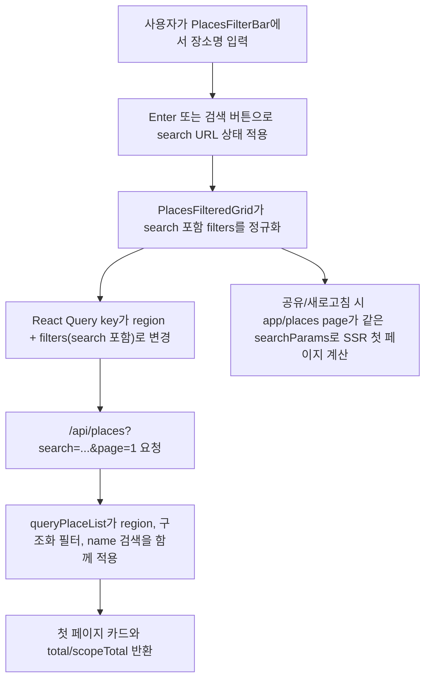

# feat: Add title search to place filters

## Overview

`/places`와 `/places/[region]`의 `조건으로 더 좁혀보기` 영역에 장소명 기준 검색을 추가한다. 검색어는 기존 필터와 같은 URL 상태로 보존하고, 서버 첫 페이지 계산, `/api/places` 응답, React Query 무한스크롤이 모두 같은 검색 조건을 사용하게 한다.

## Problem Frame

현재 Places 목록은 종류, 연령, 실내/야외, 무료, 수유실, 유모차, 우천 가능 같은 구조화 필터만 지원한다. 사용자가 특정 장소명을 이미 알고 있거나 일부 이름만 기억하는 경우에는 카드 목록을 직접 스캔해야 한다.

사용자 요청은 `조건으로 더 좁혀보기` 컴포넌트 안에서 검색 기능을 추가하고, 검색 기준을 장소 제목으로 제한하는 것이다. 따라서 이번 작업은 전문 검색이나 지역/설명/태그 검색이 아니라 `PlaceSource.name` 부분 일치 검색을 기존 필터 계약에 결합하는 데 초점을 둔다.

## Requirements Trace

- R1. `조건으로 더 좁혀보기` 컴포넌트에서 장소명 검색 입력을 사용할 수 있어야 한다.
- R2. 검색 대상은 장소 제목, 즉 `PlaceSource.name`으로 한정해야 한다.
- R3. 검색어는 기존 필터와 함께 조합되어야 하며, 지역 페이지에서는 해당 지역 범위 안에서만 검색해야 한다.
- R4. 검색어가 URL에 반영되어 새로고침, 공유 링크, 직접 진입에서 같은 결과가 재현되어야 한다.
- R5. 검색어 변경 시 무한스크롤 목록은 1페이지부터 다시 시작해야 하고, 이전 검색/필터 결과가 섞이면 안 된다.
- R6. 검색어가 비어 있거나 공백뿐이면 검색 필터가 없는 상태와 같아야 한다.
- R7. 기존 장소 seed 스키마, 카드 UI 계약, 지역 허브 라우트는 변경하지 않는다.

## Scope Boundaries

- 장소 상세 페이지, 검색 결과 전용 페이지, 자동완성, 최근 검색어, 하이라이트 표시는 포함하지 않는다.
- 검색 대상은 장소명만으로 제한한다. 설명, 주소, 세부 지역, 카테고리 라벨, 블로그 태그는 이번 검색 대상이 아니다.
- 외부 검색 엔진, DB, 검색 인덱스, 형태소 분석기는 도입하지 않는다.
- GA 이벤트 추가는 이번 구현의 필수 범위가 아니다. 리브랜딩 GA 문서에는 검색 이벤트 방향이 있지만, 현재 코드에 Places 행동 이벤트 수집 레이어가 없으므로 별도 작업으로 남긴다.

### Deferred to Separate Tasks

- Places 검색 행동 분석 이벤트: `docs/superpowers/specs/parenting-guide-rebrand/10-ga-event-tracking-strategy.md` 기준으로 `search`/`view_search_results`를 별도 계획에서 정의한다.
- 검색어 하이라이트 또는 자동완성: 실제 검색 사용 패턴을 본 뒤 별도 UX 작업으로 다룬다.

## Context & Research

### Relevant Code and Patterns

- `components/places/PlacesFilterBar.tsx`
  - `useQueryStates(placesFilterParsers)`로 필터 URL 상태를 관리하고, `조건으로 더 좁혀보기` UI를 렌더링한다.
- `components/places/PlacesFilteredGrid.tsx`
  - `placesFilterParsers`를 읽어 `normalizePlaceListFilters`로 정규화하고, `region + filters`를 React Query key로 사용한다.
  - `buildPlaceListSearchParams`로 `/api/places` 요청 파라미터를 만든다.
- `lib/places/place-list-contract.ts`
  - 필터 정규화, 검색 파라미터 생성, `PlaceListPageResponse.filters` 계약의 기준 파일이다.
- `lib/places/place-list-query.ts`
  - publishable 필터, region scope, 조건 필터, page slice를 한 곳에서 처리한다.
- `app/api/places/route.ts`
  - 클라이언트 무한스크롤이 호출하는 Places 목록 API이며, 현재 필터 파라미터를 명시적으로 전달한다.
- `app/places/page.tsx`, `app/places/[region]/page.tsx`
  - 서버 첫 페이지를 `queryPlaceList`로 계산하므로, 새 검색 파라미터가 계약에 들어가면 deep link 첫 렌더링에도 반영되어야 한다.
- `components/blog/BlogContent.tsx`
  - 검색 입력 상태와 실제 적용 검색어를 분리하는 기존 UI 패턴이 있다.
- `components/tools/ToolsPageClient.tsx`
  - `SearchIcon` + `Input`을 조합한 검색 입력 UI 패턴이 있다.
- `lib/places/place-list-query.test.mjs`
  - Places 필터/페이지네이션 계약을 pure node test로 고정하는 기존 테스트 파일이다.
- `tests/places-infinite-scroll.spec.ts`
  - 필터 변경 시 목록이 1페이지로 reset되는 E2E 검증 패턴이 있다.
- `tests/places-mobile-layout.spec.ts`
  - 모바일 필터 레일, 공유 링크, hydration 안전성 관련 기존 Places E2E 기반선이 있다.
- `docs/plans/2026-04-14-002-feat-places-infinite-scroll-plan.md`
  - 현재 Places 목록 구조가 `React Query + paginated API + first-page SSR`로 정리된 배경 계획이다.
- `docs/superpowers/specs/2026-04-06-parenting-guide-rebrand-design.md`
  - 리브랜딩 방향에서 `아이와 갈 곳, 조건별로 빠르게 찾으세요`, 검색 입력, 빠른 필터가 핵심 흐름으로 정의되어 있다.

### Institutional Learnings

- `docs/solutions/` 경로는 현재 저장소에 존재하지 않아 관련 solution 문서를 찾지 못했다.
- 따라서 이번 계획은 기존 Places 조회 계약, 블로그/도구 검색 UI 패턴, 리브랜딩 스펙을 근거로 한다. 이 판단의 신뢰도는 높다. 실제 파일 시스템 검색 기준으로 `docs/solutions/`가 없었다.

### External References

- 외부 리서치는 생략한다.
- 이유: 새 검색은 로컬 배열의 단순 장소명 부분 일치 필터이며, Next.js/React Query/nuqs 패턴은 이미 저장소 안에 직접 예시가 있다. 외부 문서보다 기존 계약 일관성이 더 중요한 저위험 변경이다.

## Key Technical Decisions

- **URL 파라미터 이름은 `search`로 둔다.**
  - 이유: `components/blog/BlogContent.tsx`와 `/api/posts`가 이미 검색 파라미터에 `search`를 사용한다. Places에서도 같은 명칭을 쓰면 API와 공유 URL 의미가 명확하다.
- **검색 대상은 `PlaceSource.name`만 사용한다.**
  - 이유: 사용자가 제목 기준 검색을 명시했다. 설명, 주소, 카테고리까지 섞으면 결과가 넓어져 요구 범위를 벗어난다.
- **검색은 trim 후 길이를 제한한 부분 일치로 처리하고, 공백 검색어는 null과 동일하게 본다.**
  - 이유: 장소명 검색의 기대 동작은 간단한 포함 검색이다. 한국어에는 대소문자 영향이 거의 없지만, 영문이 섞인 이름을 위해 비교 시 소문자 정규화는 허용한다. 공개 query 입력이므로 과도하게 긴 문자열은 계약 레이어에서 80자로 잘라 URL과 per-request 비교 비용을 제한한다.
- **검색어는 기존 필터 계약의 일부로 넣는다.**
  - 이유: 서버 첫 페이지, API, React Query key, 결과 카운트, 공유 URL이 모두 같은 상태를 기준으로 움직여야 한다.
- **입력 중 문자열과 적용된 검색어를 분리한다.**
  - 이유: 타이핑마다 URL history와 API 요청을 만들지 않고, 사용자가 Enter 또는 검색 버튼으로 적용한 시점에 목록을 갱신하게 한다. 이는 블로그 검색 UI의 `searchInput`/`searchQuery` 분리 패턴과 맞다.
- **초기화는 검색어까지 함께 지운다.**
  - 이유: 검색이 필터 보드의 조건 중 하나가 되므로, `초기화`가 구조화 필터만 지우고 검색어를 남기면 사용자 기대와 결과 카운트가 어긋난다.

## Open Questions

### Resolved During Planning

- 검색 파라미터를 `q`로 둘지 `search`로 둘지:
  - `search`로 결정한다. 기존 블로그 API와 UI가 같은 의미로 쓰는 명칭이기 때문이다.
- 검색 적용 시점을 입력 즉시로 할지 제출형으로 할지:
  - 제출형으로 결정한다. URL 공유는 유지하되 타이핑 중 불필요한 history/API 변화를 줄인다.
- 검색 범위를 `/places`만 볼지 지역 페이지까지 포함할지:
  - 둘 다 포함한다. 두 페이지가 같은 `PlacesFilteredGrid`와 `queryPlaceList` 계약을 공유한다.

### Deferred to Implementation

- 검색 입력의 정확한 모바일 배치:
  - `PlacesFilterBar`의 현재 카드형 레이아웃과 필터 레일 간격을 보고 결정한다. 단, 입력/버튼이 360px 폭에서 겹치거나 줄바꿈으로 깨지면 안 된다.
- 검색 결과 없음 문구에 검색어를 노출할지:
  - 기본 no-result 상태를 재사용하되, UI 밀도가 허용되면 검색어 포함 문구로 개선할 수 있다.

## High-Level Technical Design

> _이 섹션은 구현 코드를 쓰기 위한 명세가 아니라, 접근 방식 검토를 위한 방향 설명이다. 구현 시 실제 함수명과 세부 구조는 코드베이스 맥락에 맞게 조정한다._

## Implementation Units

- [x] **Unit 1: Places 목록 검색 계약 확장**

**Goal:** `search`를 Places 목록 필터 계약에 추가하고, 장소명 기준 필터링을 서버/API/클라이언트가 공유하는 pure query 레이어에 넣는다.

**Requirements:** R2, R3, R4, R5, R6, R7

**Dependencies:** 없음

**Files:**

- Modify: `lib/places/place-list-contract.ts`
- Modify: `lib/places/place-list-query.ts`
- Test: `lib/places/place-list-query.test.mjs`

**Approach:**

- `PlaceListFilters`와 query option 정규화에 검색어 필드를 추가한다.
- 검색어는 raw query에서 읽고 trim 후 빈 문자열이면 null/empty 상태로 정규화한다.
- 검색어 길이는 계약 레이어에서 80자로 제한한다. UI와 API가 서로 다른 제한을 갖지 않도록 한 곳에서 정규화한다.
- `buildPlaceListSearchParams`는 적용된 검색어가 있을 때만 `search`를 URLSearchParams에 포함한다.
- `applyPlaceListFilters`는 기존 category/age/boolean 조건과 함께 `place.name` 부분 일치 검색을 적용한다.
- 필터 응답의 `filters`에도 정규화된 검색어가 포함되어 SSR 첫 페이지와 React Query initial data 비교가 어긋나지 않게 한다.

**Execution note:** 새 검색 의미는 pure helper 테스트로 먼저 고정한다. 특히 기존 구조화 필터 의미가 변하지 않는지 함께 확인한다.

**Patterns to follow:**

- `lib/places/place-list-contract.ts`의 boolean/category/age 정규화 패턴
- `lib/places/place-list-query.ts`의 region scope 후 필터 적용 흐름
- `lib/places/place-list-query.test.mjs`의 fixture 기반 whole-result assertion

**Test scenarios:**

- Happy path: `search`에 장소명 일부를 넣으면 publishable place 중 `name`에 해당 문자열이 포함된 장소만 반환된다.
- Happy path: `region=seoul`과 `search`를 함께 주면 서울 scope 안에서 이름이 일치하는 장소만 반환된다.
- Happy path: `category=library`와 `search`를 함께 주면 두 조건을 모두 만족하는 장소만 반환된다.
- Edge case: `search`가 공백뿐이면 검색 필터가 없는 것처럼 `total`, `scopeTotal`, 첫 페이지 결과가 유지된다.
- Edge case: 80자를 넘는 검색어는 계약 레이어에서 동일한 최대 길이로 정규화되고, 응답의 `filters.search`에도 정규화된 값이 담긴다.
- Edge case: 영문이 섞인 장소명 fixture에서 대소문자 차이가 있어도 같은 결과를 반환한다.
- Error path: `search`가 배열, 숫자, null, undefined 형태로 들어와도 helper가 예외를 던지지 않고 정규화한다.
- Integration: 검색으로 결과 수가 페이지 크기를 넘을 때 `hasMore`, `currentPage`, `totalPages`가 기존 pagination 규칙과 일관된다.

**Verification:**

- 같은 입력에 대해 서버 페이지와 `/api/places`가 동일한 검색 필터 결과를 계산할 수 있는 계약이 생긴다.

- [x] **Unit 2: API, SSR 첫 페이지, React Query 연결**

**Goal:** `search` 파라미터가 `/api/places`, `/places`, `/places/[region]`, `PlacesFilteredGrid` 사이에서 누락 없이 전달되게 한다.

**Requirements:** R3, R4, R5, R6

**Dependencies:** Unit 1

**Files:**

- Modify: `app/api/places/route.ts`
- Modify: `components/places/PlacesFilteredGrid.tsx`
- Test: `tests/places-infinite-scroll.spec.ts`

**Approach:**

- `/api/places` route handler가 `searchParams.get('search')`를 query helper에 넘기도록 확장한다.
- `PlacesFilteredGrid`의 `queryState`, `normalizePlaceListFilters`, `queryKey`, API search params 생성이 검색어를 포함하도록 한다.
- `areFiltersEqual` 같은 initial page 비교 로직이 검색어까지 비교하게 한다. 검색어가 빠지면 deep link 첫 진입에서 SSR page와 client query 상태가 어긋날 수 있다.
- `app/places/page.tsx`와 `app/places/[region]/page.tsx`는 이미 전체 `searchParams`를 `queryPlaceList`에 넘기므로, Unit 1 계약 확장 후 추가 변경이 필요한지 구현 중 확인한다.
- 검색어가 바뀌면 React Query key가 바뀌어 페이지 누적이 1페이지부터 다시 시작되게 한다.

**Patterns to follow:**

- `components/places/PlacesFilteredGrid.tsx`의 기존 `regionSlug + filters` query key 구성
- `buildPlaceListSearchParams`를 통해 API query string을 조립하는 현재 방식
- `tests/places-infinite-scroll.spec.ts`의 필터 변경 후 카드 수 reset 검증

**Test scenarios:**

- Happy path: `/places?search=<장소명 일부>`로 직접 진입하면 첫 렌더링 카드 목록과 결과 수가 검색 조건을 반영한다.
- Happy path: `/places/seoul?search=<장소명 일부>`로 직접 진입하면 서울 지역 범위 안에서만 검색한다.
- Edge case: 검색어 적용 전에 더 많은 카드를 로드한 뒤 새 검색어를 적용하면 카드 목록이 새 검색 결과의 첫 페이지로 reset된다.
- Edge case: `search`와 기존 boolean/category 필터가 함께 있을 때 API 요청 URL에 모든 조건이 함께 들어간다.
- Error path: 검색어가 포함된 `/api/places` 요청 실패 시 기존 grid error state가 page shell 전체를 깨지 않고 표시된다.
- Integration: 공유 URL로 들어온 검색 결과와, UI에서 같은 검색어를 적용한 결과의 첫 카드 집합과 total이 일치한다.

**Verification:**

- 검색 URL, API fetch, React Query cache key, SSR initial page가 모두 같은 검색 조건을 공유한다.

- [x] **Unit 3: `PlacesFilterBar` 검색 UI 추가**

**Goal:** `조건으로 더 좁혀보기` 카드 안에서 장소명 검색 입력을 제공하고, 기존 필터/초기화 UX와 함께 동작하게 한다.

**Requirements:** R1, R4, R5, R6, R7

**Dependencies:** Unit 1, Unit 2

**Files:**

- Modify: `components/places/PlacesFilterBar.tsx`
- Test: `tests/places-mobile-layout.spec.ts`
- Test: `tests/places-infinite-scroll.spec.ts`

**Approach:**

- `placesFilterParsers`에 검색 문자열 parser를 추가하고, `PlacesFilter` 타입에도 검색어 상태를 포함한다.
- UI는 기존 필터 보드 안에 `SearchIcon` + 텍스트 입력 + 검색 버튼 또는 Enter 제출 흐름으로 배치한다.
- 입력 중 draft와 URL에 적용된 검색어를 분리한다. 초기 렌더링, 공유 URL 직접 진입, 브라우저 뒤로가기/앞으로가기처럼 URL 검색어가 바뀌는 경우 draft도 적용 검색어와 다시 동기화한다.
- 적용된 검색어가 있으면 `isActive`가 true가 되게 하고, `초기화`가 검색어와 구조화 필터를 모두 지우게 한다.
- 검색어 제출 시 trim 결과가 비어 있으면 `search` URL 파라미터를 제거한다.
- 검색 입력에는 접근 가능한 label 또는 `aria-label`을 제공하고, Enter 제출과 버튼 클릭이 같은 적용 동작을 수행하게 한다.
- 모바일 360px 폭에서도 입력과 버튼 텍스트가 겹치지 않도록 stable height/width, 줄바꿈, 아이콘 위치를 잡는다.

**Patterns to follow:**

- `components/tools/ToolsPageClient.tsx`의 `SearchIcon` + `Input` 구성
- `components/blog/BlogContent.tsx`의 입력 draft와 적용 검색어 분리
- `components/places/PlacesFilterBar.tsx`의 기존 `useQueryStates` + clear-all 흐름

**Test scenarios:**

- Happy path: 검색 입력에 장소명 일부를 입력하고 Enter 또는 검색 버튼을 누르면 URL에 `search`가 반영되고, 카드 목록이 해당 장소명 결과로 갱신된다.
- Happy path: 검색어가 적용된 상태에서 `초기화`를 누르면 `search`와 기존 필터 query가 모두 제거되고 전체 결과 수로 돌아간다.
- Edge case: 공백만 입력하고 검색을 적용하면 `search` query가 남지 않고 기존 결과가 유지된다.
- Edge case: 검색어가 적용된 공유 URL로 진입하면 입력 칸에 동일한 검색어가 표시된다.
- Edge case: 검색어를 적용한 뒤 브라우저 뒤로가기로 이전 URL 상태로 돌아가면 입력 draft와 목록 결과가 이전 검색 상태로 함께 복원된다.
- Edge case: 360px 모바일 폭에서 검색 입력, 검색 버튼, 초기화 링크, 필터 레일이 서로 겹치지 않는다.
- Edge case: 키보드 사용자가 검색 입력에서 Enter를 눌러 검색을 적용할 수 있고, 검색 버튼의 accessible name이 명확하다.
- Integration: 검색어와 카테고리/연령/조건 필터를 함께 적용해도 결과 수 문구가 `scopeTotalCount`와 `matchedTotalCount`를 일관되게 보여준다.

**Verification:**

- 사용자는 필터 보드 안에서 장소명을 검색하고, 검색 결과 URL을 공유하거나 새로고침해도 같은 목록을 볼 수 있다.

## System-Wide Impact

- **Interaction graph:** `PlacesFilterBar` URL 상태 변경 → `PlacesFilteredGrid` query key 변경 → `/api/places` fetch → `queryPlaceList` 필터 적용 → `PlaceCard` 목록 렌더링 흐름에 검색어가 추가된다.
- **Error propagation:** 검색 자체는 로컬 필터라 별도 실패 지점이 없지만, 검색 포함 API fetch 실패는 기존 `PlacesFilteredGrid` error state를 사용한다.
- **State lifecycle risks:** 입력 draft와 URL 적용 검색어가 어긋날 수 있다. 초기 URL 값 동기화, 제출 시 trim, 초기화 시 draft reset을 명시적으로 처리해야 한다.
- **API surface parity:** `/api/places`, `buildPlaceListSearchParams`, `PlaceListFilters`, `PlaceListPageResponse.filters`, `PlacesFilteredGrid` query key가 모두 `search`를 같은 의미로 포함해야 한다.
- **Integration coverage:** pure helper 테스트만으로는 URL deep link, 무한스크롤 reset, 모바일 입력 배치를 보장하지 못하므로 E2E가 필요하다.
- **Unchanged invariants:** 기존 `age`, `category`, `indoor`, `outdoor`, `free`, `feeding`, `stroller`, `rain` 필터 의미와 `PlaceCard` props shape는 바꾸지 않는다.

## Risks & Dependencies

| Risk                                                                 | Mitigation                                                                                               |
| -------------------------------------------------------------------- | -------------------------------------------------------------------------------------------------------- |
| 검색어가 계약 일부에 빠져 SSR 첫 페이지와 client query 결과가 달라짐 | `PlaceListPageResponse.filters`, `areFiltersEqual`, query key, API params에 검색어를 모두 포함한다.      |
| 타이핑마다 URL history와 API 요청이 늘어남                           | 입력 draft와 적용 검색어를 분리하고 제출 시에만 URL 상태를 갱신한다.                                     |
| 검색이 제목 외 필드까지 넓어져 결과가 예상보다 많아짐                | `place.name`만 검색한다는 요구를 pure helper 테스트로 고정한다.                                          |
| 공개 query 입력이 과도하게 길어 URL과 필터 비교 비용이 커짐          | 계약 레이어에서 검색어를 trim하고 80자로 제한한다.                                                       |
| 모바일 필터 카드가 검색 입력 추가로 과밀해짐                         | `tests/places-mobile-layout.spec.ts`에 작은 폭 배치 검증을 추가하고, 필요하면 입력/버튼을 세로 배치한다. |
| 기존 필터 초기화가 검색어를 남겨 혼란을 줌                           | `clearAll` 범위에 검색어와 draft reset을 포함한다.                                                       |

## Documentation / Operational Notes

- 사용자-facing 도움말 문서 업데이트는 필요하지 않다. 검색 입력 자체가 기능을 드러낸다.
- GA 이벤트는 별도 계획으로 분리한다. 리브랜딩 GA 문서는 검색어 원문 대신 `query_length`, `results_count`, `search_area`만 보내도록 안내하므로, 추후 이벤트 작업 시 원문 검색어를 보내지 않아야 한다.
- 배포 전에는 기존 Places 링크 공유 동작이 `search` 파라미터를 포함한 현재 URL을 그대로 복사하는지 확인한다.

## Sources & References

- Related code: `components/places/PlacesFilterBar.tsx`
- Related code: `components/places/PlacesFilteredGrid.tsx`
- Related code: `lib/places/place-list-contract.ts`
- Related code: `lib/places/place-list-query.ts`
- Related code: `app/api/places/route.ts`
- Related tests: `lib/places/place-list-query.test.mjs`
- Related tests: `tests/places-infinite-scroll.spec.ts`
- Related tests: `tests/places-mobile-layout.spec.ts`
- Prior plan: `docs/plans/2026-04-14-002-feat-places-infinite-scroll-plan.md`
- Rebrand spec: `docs/superpowers/specs/2026-04-06-parenting-guide-rebrand-design.md`
- Analytics note: `docs/superpowers/specs/parenting-guide-rebrand/10-ga-event-tracking-strategy.md`
