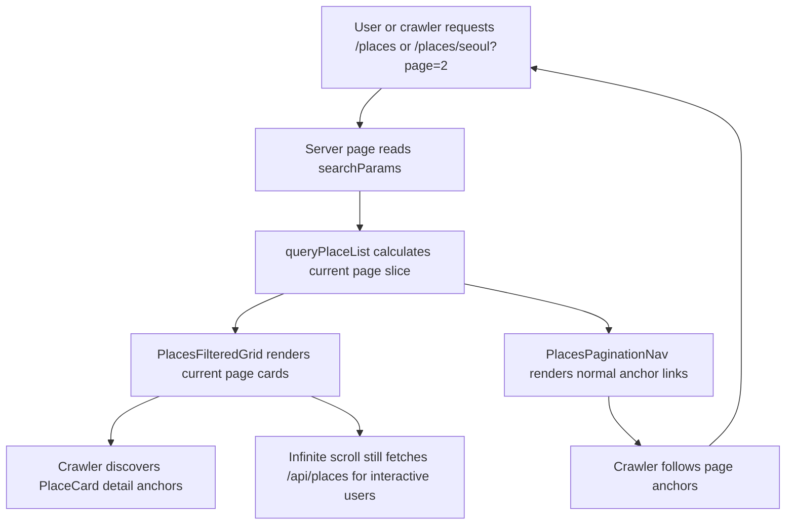
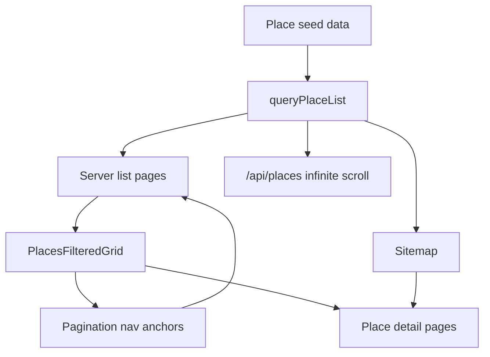

# feat: Add crawlable pagination for place indexing

## Overview

`/places` and `/places/[region]` already use first-page SSR plus React Query infinite scroll. That protects initial performance, but it leaves page 2+ place detail links discoverable mainly through JavaScript-driven `/api/places?page=N` fetches. This plan adds a small, visible, crawlable pagination path so Googlebot and other crawlers can discover every place detail URL through normal HTML anchors while the current infinite-scroll user experience stays intact.

The implementation should keep the pagination UI intentionally quiet. It must not be hidden with `display: none`, off-screen positioning, opacity tricks, or crawler-only content. The fallback exists for both users and crawlers.

## Problem Frame

Search Console shows place pages are not all being indexed. The likely technical cause is not the place detail route itself: `app/places/[region]/[placeId]/page.tsx` has static params, canonical metadata, and publishable-place validation. The discoverability gap is in list navigation. `components/places/PlacesFilteredGrid.tsx` renders the initial server payload, then loads later pages through `useInfiniteQuery`, `IntersectionObserver`, and `/api/places`. Crawlers may not reliably scroll far enough or trigger client-side pagination flows.

Current publishable place volume is already larger than the first page size:

| Scope          | Publishable places | Pages at 18 per page |
| -------------- | -----------------: | -------------------: |
| All places     |                220 |                   13 |
| Seoul          |                 98 |                    6 |
| Gyeonggi South |                 57 |                    4 |
| Gyeonggi North |                 33 |                    2 |
| Incheon        |                 32 |                    2 |

Without crawlable page links, many detail pages only become visible after JavaScript loads later API pages.

## Requirements Trace

- R1. Every unfiltered global and region place-list page must expose page 2+ navigation through normal `<a href>` links in the initial HTML.
- R2. Infinite scroll must keep working for users; the fallback pagination must complement, not replace, the current interaction.
- R3. Place detail URLs must remain canonical at `/places/[region]/[placeId]`; no detail route behavior or publishability rules should change.
- R4. Pagination URLs must have a clear SEO policy: unfiltered list pages are crawlable/indexable, while arbitrary filter combinations do not create uncontrolled indexable URL variants.
- R5. `sitemap.xml` must continue to include all publishable detail URLs and should include crawlable unfiltered place-list pagination URLs where they help discovery.
- R6. New behavior must be covered by behavior-focused tests that verify crawlable anchors and SEO URL generation, not only internal function calls.

## Scope Boundaries

- Do not remove the current infinite scroll behavior.
- Do not hide pagination from users or create crawler-only markup.
- Do not change place seed schema, publishable statuses, or place detail page validation.
- Do not make every filter combination an SEO landing page.
- Do not add a database, search index, or third-party crawler integration.

### Deferred to Separate Tasks

- Dedicated SEO landing pages for high-value filtered intents such as "서울 무료 실내 아이와 가볼 곳".
- Search Console submission/inspection operations after deployment.
- Content-quality improvements for place detail pages if Search Console reports "Crawled - currently not indexed" after crawl discovery is fixed.

## Context & Research

### Relevant Code and Patterns

- `docs/plans/2026-04-14-002-feat-places-infinite-scroll-plan.md`
  - Prior plan that introduced the current first-page SSR plus paginated API plus infinite scroll model.
- `app/places/page.tsx`
  - Reads `searchParams`, calls `queryPlaceList()`, and passes `initialPage` into `PlacesHub`.
- `app/places/[region]/page.tsx`
  - Applies region scope through `queryPlaceList({ ...searchParams, region })`.
- `components/places/PlacesFilteredGrid.tsx`
  - Client component using `useInfiniteQuery`, `/api/places`, and an intersection sentinel.
- `lib/places/place-list-contract.ts`
  - Defines `DEFAULT_PLACES_PAGE_SIZE`, filter normalization, and `buildPlaceListSearchParams()`.
- `lib/places/place-list-query.ts`
  - Shared pure query helper for filtering, region scoping, paging, and pagination metadata.
- `app/places/[region]/[placeId]/page.tsx`
  - Generates static params for publishable detail pages and self-canonical detail metadata.
- `lib/seo/sitemap.ts`
  - Currently includes region entries and all publishable detail entries through `collectPlaceEntries()`.
- `docs/seo/google-indexing-action-list-2026-05-08.md`
  - Existing SEO operations note says `/places?*` filter URLs should canonicalize to representative place URLs.
- `tests/places-infinite-scroll.spec.ts`
  - Existing Playwright coverage for API filtering, region scope, infinite scroll append, and filter reset behavior.
- `lib/places/place-list-query.test.mjs`
  - Existing pure tests for filtering, paging, invalid query handling, and region scope.

### Institutional Learnings

- `docs/solutions/` was checked and no relevant institutional solution documents were present.
- Memory lookup found only the memory repository bootstrap note; there is no stored prior project learning for this specific indexing issue.

### External References

- Google Search Central: [Crawlable links](https://developers.google.com/search/docs/crawling-indexing/links-crawlable)
- Google Search Central: [Fix lazy-loaded content](https://developers.google.com/search/docs/crawling-indexing/javascript/lazy-loading)
- Google Search Central: [Sitemaps overview](https://developers.google.com/search/docs/crawling-indexing/sitemaps/overview)

## Key Technical Decisions

| Decision                                                                                                                | Rationale                                                                                                                                                               |
| ----------------------------------------------------------------------------------------------------------------------- | ----------------------------------------------------------------------------------------------------------------------------------------------------------------------- |
| Use `?page=N` for crawlable list pages instead of adding `/page/N` route segments.                                      | Existing server pages already accept `searchParams`, `queryPlaceList()` already supports `page`, and this avoids new route conflicts with `/places/[region]/[placeId]`. |
| Add visible fallback pagination below the place list.                                                                   | Google guidance favors crawlable anchors, and hiding links would create SEO risk. A compact user-visible nav is safer and more honest.                                  |
| Treat unfiltered pagination URLs as canonical/indexable; canonicalize filtered URLs back to their unfiltered base page. | This creates a finite crawl graph for discovery without exploding crawl budget across filter permutations, while preserving filter URLs for users.                      |
| Include unfiltered list pagination URLs in sitemap in addition to detail URLs.                                          | Detail URLs are already present, but list pagination URLs give crawlers a second, structured discovery path with ordinary internal links.                               |
| Keep `/api/places` unchanged except where needed for parity.                                                            | The API already serves infinite scroll well; the gap is crawlable navigation, not the data contract.                                                                    |

## Open Questions

### Resolved During Planning

- Should pagination be hidden from users?
  - No. The component must be visible and usable, though visually quiet.
- Should this replace infinite scroll?
  - No. Infinite scroll remains the primary experience; pagination is a fallback and crawl path.
- Should route segments like `/places/seoul/page/2` be introduced?
  - No for this iteration. `?page=N` gives the needed crawlable URLs with less route churn.
- Should all filter combinations be indexable?
  - No. Keep filter URLs functional for sharing, but do not turn every combination into an indexable SEO page.

### Deferred to Implementation

- Exact pagination window size:
  - Use a compact window, but final count should be tuned while checking mobile layout and Korean labels.
- Whether to add `rel="prev"` and `rel="next"` metadata:
  - Helpful for non-Google consumers and internal clarity, but not the core Google discovery mechanism.

## High-Level Technical Design

> This illustrates the intended approach and is directional guidance for review, not implementation specification. The implementing agent should treat it as context, not code to reproduce.

## Implementation Units

- [x] **Unit 1: Define place pagination URL and SEO policy helpers**

**Goal:** Centralize the rules for building place-list page URLs, deciding whether a list URL is SEO-indexable, and preserving only the intended query parameters.

**Requirements:** R1, R4, R5, R6

**Dependencies:** None

**Files:**

- Create: `lib/places/place-pagination.ts`
- Test: `lib/places/place-pagination.test.mjs`
- Modify: `lib/places/index.ts`

**Approach:**

- Add a small pure helper layer that builds pagination hrefs for:
  - Global list pages: `/places`, `/places?page=2`, `/places?page=N`
  - Region list pages: `/places/seoul`, `/places/seoul?page=2`, `/places/seoul?page=N`
- Page 1 hrefs should omit `page=1`.
- Invalid or out-of-range page inputs should normalize consistently with `queryPlaceList()`.
- The helper should distinguish:
  - SEO page links for unfiltered crawl paths.
  - Functional pagination links that preserve current filters for user navigation.
- The SEO policy helper should allow implementation units 3 and 4 to avoid duplicating filter/canonical logic.

**Execution note:** Start with pure tests because this helper defines the crawl graph contract.

**Patterns to follow:**

- `lib/places/place-list-contract.ts`
- `lib/places/place-list-query.ts`
- `lib/places/place-list-query.test.mjs`

**Test scenarios:**

- Happy path: global page 1 produces `/places`, global page 2 produces `/places?page=2`.
- Happy path: region page 1 produces `/places/seoul`, region page 2 produces `/places/seoul?page=2`.
- Edge case: page 0, negative page, and non-numeric page normalize to page 1 behavior.
- Edge case: page values greater than `totalPages` clamp or resolve consistently with `queryPlaceList()` so generated links never point past the known range.
- Happy path: functional links preserve active filters such as `search=서울&free=true` while SEO sitemap links omit filters.
- Edge case: helper treats `page=1` as canonical-equivalent to the base URL.

**Verification:**

- Other units can build pagination links and canonical URLs without hand-assembling query strings.

- [x] **Unit 2: Add a visible crawlable pagination component to place lists**

**Goal:** Render a small pagination navigation block with normal anchor links in the initial HTML of `/places` and `/places/[region]`.

**Requirements:** R1, R2, R4, R6

**Dependencies:** Unit 1

**Files:**

- Create: `components/places/PlacesPaginationNav.tsx`
- Modify: `components/places/PlacesFilteredGrid.tsx`
- Test: `tests/places-crawlable-pagination.spec.ts`

**Approach:**

- Render the nav near the list footer, close to the existing infinite-scroll sentinel and "더 불러오기" button.
- Keep visual weight low: compact text/buttons, accessible labels, and no large decorative container.
- Use real anchors through `next/link` or plain `<a>` with `href`; do not use buttons for page navigation.
- Links should be visible to users and should not use `hidden`, `aria-hidden`, `display: none`, opacity hiding, or off-screen positioning.
- For unfiltered pages, links should point to the canonical unfiltered pagination path.
- For active filters, preserve filter query params for usability, but do not let that imply those filtered pages are indexable.
- Ensure the current page can be understood by users through `aria-current="page"` or equivalent accessible state.

**Patterns to follow:**

- `components/places/PlacesFilteredGrid.tsx` layout and copy tone
- `components/places/place-theme.ts`
- Existing button/link styling in `components/places/RegionHub.tsx`

**Test scenarios:**

- Happy path: visiting `/places` renders an anchor with `href="/places?page=2"` when more than one page exists.
- Happy path: visiting `/places/seoul` renders an anchor with `href="/places/seoul?page=2"`.
- Happy path: visiting `/places/seoul?page=2` renders first/previous/next page anchors with the correct region path.
- Edge case: a region with exactly two pages renders page 1 and page 2 links without pointing to page 3.
- Edge case: a query with filters such as `/places?free=true` preserves `free=true` in functional page links.
- Accessibility: current page is marked without removing the underlying link graph from other page numbers.
- Regression: the existing infinite-scroll "더 불러오기" behavior still appends API pages.

**Verification:**

- View-source or Playwright DOM inspection can find page anchors before any scrolling or API-triggered page append.

- [x] **Unit 3: Make list-page metadata explicit for pagination and filters**

**Goal:** Ensure list pagination URLs have clear canonical/indexing behavior and do not create accidental duplicate or infinite crawl surfaces.

**Requirements:** R3, R4, R6

**Dependencies:** Unit 1

**Files:**

- Modify: `app/places/page.tsx`
- Modify: `app/places/[region]/page.tsx`
- Modify: `lib/seo/site-section-seo.ts`
- Test: `lib/seo/site-section-seo.test.ts`
- Test: `tests/places-crawlable-pagination.spec.ts`

**Approach:**

- Replace static `/places` metadata with metadata generation that can inspect `searchParams`.
- Extend region metadata generation to inspect `searchParams` as well as `params`.
- For unfiltered `page=N` URLs:
  - Use a self-referencing canonical URL.
  - Include page-specific titles/descriptions only enough to avoid identical metadata across the paginated series.
- For filtered URLs:
  - Keep the page functional and shareable.
  - Canonicalize back to the equivalent unfiltered base URL for that scope, omitting both filters and `page`.
  - Do not include filtered URLs in sitemap or make them distinct SEO landing pages in this iteration.
- Preserve existing detail page metadata in `app/places/[region]/[placeId]/page.tsx`.

**Patterns to follow:**

- `lib/seo/metadata.ts`
- `lib/seo/site-section-seo.ts`
- Existing pagination metadata helper behavior in `lib/seo/metadata.ts`

**Test scenarios:**

- Happy path: `/places?page=2` metadata resolves to a canonical ending in `/places?page=2`.
- Happy path: `/places/seoul?page=2` metadata resolves to a canonical ending in `/places/seoul?page=2`.
- Edge case: `/places?page=1` canonical resolves to `/places`.
- Edge case: `/places?free=true&page=2` canonicalizes to `/places`.
- Edge case: `/places/seoul?free=true&page=2` canonicalizes to `/places/seoul`.
- Regression: `/places/seoul` page 1 metadata remains equivalent to the current region canonical behavior.
- Regression: detail page canonical URLs remain `/places/[region]/[placeId]`.

**Verification:**

- Metadata behavior makes the indexable URL set finite and intentional.

- [x] **Unit 4: Add sitemap coverage for crawlable place-list pagination**

**Goal:** Include unfiltered global and region pagination URLs in sitemap generation while retaining all publishable place detail URLs.

**Requirements:** R1, R4, R5, R6

**Dependencies:** Unit 1

**Files:**

- Modify: `lib/seo/sitemap.ts`
- Test: `lib/seo/sitemap.test.mjs`

**Approach:**

- Add unfiltered list pagination entries derived from `queryPlaceList()` totals and `DEFAULT_PLACES_PAGE_SIZE`.
- Include:
  - `/places?page=2` through the final global list page.
  - `/places/[region]?page=2` through each region's final list page.
- Keep existing region page entries and detail page entries.
- Do not include filtered URLs in sitemap.
- Reuse `pickLatestDate()` and place observed/verified dates where practical so pagination entries have meaningful `lastModified` values.
- Keep entry count small and deterministic; current expected pagination sitemap additions are modest.

**Patterns to follow:**

- `collectPlaceEntries()` in `lib/seo/sitemap.ts`
- Existing sitemap entry shape in `types/seo.ts`
- `lib/seo/sitemap.test.mjs`

**Test scenarios:**

- Happy path: `collectPlaceEntries()` includes every publishable detail URL.
- Happy path: global pagination entries include page 2 through the expected final page and omit `page=1`.
- Happy path: each Phase A region includes page 2 through its expected final page when `totalPages > 1`.
- Edge case: a single-page region does not add pagination sitemap entries.
- Edge case: sitemap pagination entries do not contain filter query params.
- Regression: existing `/places/[region]` entries remain present.

**Verification:**

- Sitemap gives crawlers a finite crawlable list-page graph in addition to direct detail URLs.

- [x] **Unit 5: Add crawlability-focused regression coverage and maintenance notes**

**Goal:** Protect the SEO fallback from future regressions and document the rule that pagination must remain user-visible.

**Requirements:** R1, R2, R4, R5, R6

**Dependencies:** Units 2, 3, and 4

**Files:**

- Create: `tests/places-crawlable-pagination.spec.ts`
- Modify: `tests/places-infinite-scroll.spec.ts`
- Modify: `docs/seo/google-indexing-action-list-2026-05-08.md`

**Approach:**

- Add E2E coverage that inspects anchors on the initial page without scrolling to the sentinel.
- Verify both global and region pages expose pagination anchors.
- Verify page 2 direct navigation renders the expected page slice and still exposes detail-card links.
- Keep existing infinite-scroll tests, but add a regression that the visible pagination nav coexists with the current "더 불러오기" behavior.
- Add a short maintenance note for future place-list changes:
  - Do not hide crawlable pagination.
  - Do not add filtered URLs to sitemap by default.
  - Keep sitemap, canonical behavior, and list pagination helper in sync when page size or region coverage changes.

**Patterns to follow:**

- `tests/places-infinite-scroll.spec.ts`
- `tests/places-links.spec.ts`
- Existing indexing policy style in `docs/seo/google-indexing-action-list-2026-05-08.md`

**Test scenarios:**

- Happy path: `/places` initial DOM contains normal anchors for page navigation and place detail cards.
- Happy path: `/places/seoul?page=2` renders the second page slice from `queryPlaceList({ region: 'seoul', page: 2 })`.
- Edge case: direct navigation to an excessive page number resolves to the last valid page behavior consistently with `queryPlaceList()`.
- Integration: a crawler-like test that does not scroll can discover at least one page 2 URL and at least one detail URL from the rendered HTML.
- Regression: scrolling still loads additional cards through the existing API path.

**Verification:**

- The crawlability contract is explicit in tests and docs, not only implied by implementation.

## System-Wide Impact

- **Interaction graph:** Place seed data flows through `queryPlaceList()` into server-rendered list pages, `/api/places`, sitemap generation, and detail links. The pagination helper becomes the shared contract for list page hrefs.
- **Error propagation:** Invalid page/filter inputs should normalize to safe list behavior rather than throwing or producing 500s.
- **State lifecycle risks:** Infinite scroll loaded pages and URL page navigation are different navigation modes. The plan must avoid mixing a scrolled client state with a direct `?page=N` canonical state in a way that confuses users.
- **API surface parity:** `/api/places` should continue to serve interactive loading. The crawlable fallback should not require API consumers to change.
- **Integration coverage:** Unit tests cover URL/sitemap helpers, while Playwright covers rendered anchors and coexistence with infinite scroll.
- **Unchanged invariants:** Publishable statuses, region slugs, place detail URL structure, and detail canonical metadata remain unchanged.

## Risks & Dependencies

| Risk                                                                                    | Mitigation                                                                                                                            |
| --------------------------------------------------------------------------------------- | ------------------------------------------------------------------------------------------------------------------------------------- |
| Pagination links are visually hidden and interpreted as manipulative SEO.               | Require visible, user-usable pagination and test for anchors instead of hidden markup.                                                |
| Filter combinations create a crawl-budget explosion.                                    | Sitemap includes only unfiltered pagination; metadata policy prevents arbitrary filtered URLs from becoming separate canonical pages. |
| Canonical policy accidentally points page 2+ back to page 1, weakening crawl discovery. | Add metadata helper tests for unfiltered `?page=N` self-canonical behavior.                                                           |
| UI becomes cluttered below the infinite-scroll list.                                    | Keep pagination compact and visually secondary, close to the existing list footer.                                                    |
| Sitemap and UI pagination drift when page size changes.                                 | Centralize page count/href generation through shared helpers and test expected URL sets.                                              |
| Search Console still reports non-indexing after discovery is fixed.                     | Treat that as a separate content-quality/index-selection issue, not a crawlability implementation failure.                            |

## Documentation / Operational Notes

- After deployment, submit or refresh `https://www.zento.kr/sitemap.xml` in Search Console.
- Use URL Inspection on examples from:
  - `/places?page=2`
  - `/places/seoul?page=2`
  - A place detail URL that previously was not indexed.
- Compare Search Console states:
  - "Discovered - currently not indexed" improving suggests crawl discovery helped.
  - "Crawled - currently not indexed" persisting suggests content quality, duplication, or index-selection work is needed next.

## Sources & References

- Related prior plan: `docs/plans/2026-04-14-002-feat-places-infinite-scroll-plan.md`
- Related code: `components/places/PlacesFilteredGrid.tsx`
- Related code: `lib/places/place-list-query.ts`
- Related code: `lib/seo/sitemap.ts`
- Related tests: `tests/places-infinite-scroll.spec.ts`
- Related docs: `docs/seo/google-indexing-action-list-2026-05-08.md`
- Google Search Central: [Crawlable links](https://developers.google.com/search/docs/crawling-indexing/links-crawlable)
- Google Search Central: [Fix lazy-loaded content](https://developers.google.com/search/docs/crawling-indexing/javascript/lazy-loading)
- Google Search Central: [Sitemaps overview](https://developers.google.com/search/docs/crawling-indexing/sitemaps/overview)
