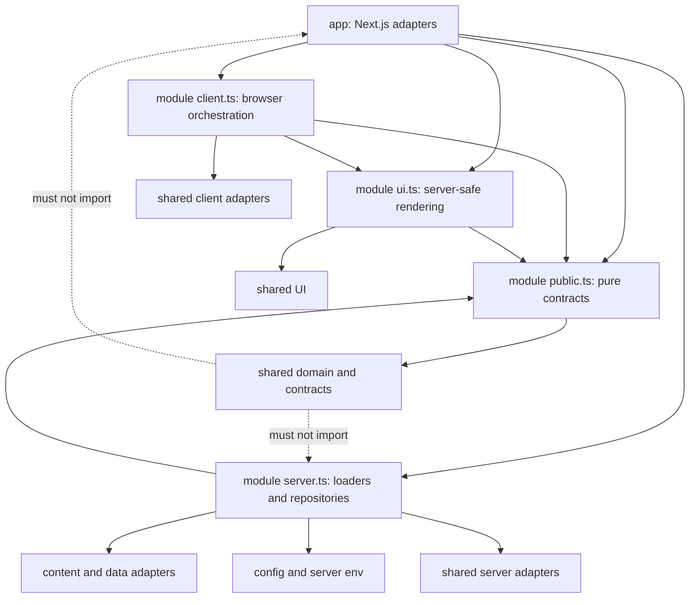
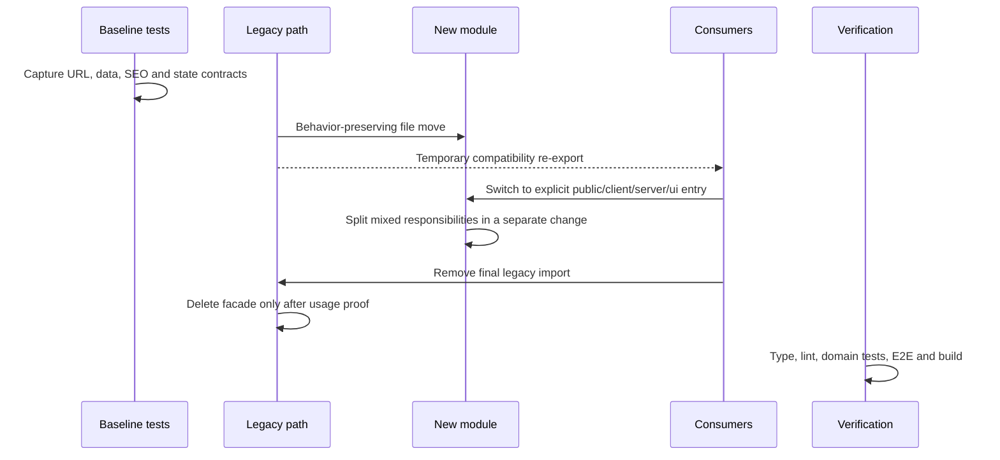

# 도메인 모듈 중심 프로젝트 구조 개선 - Plan

## Goal Capsule

기능을 수정할 때 `app`, `components`, `lib`, `hooks`, `types`, `tests`를 횡단하며 파일을 찾는 현재 구조를, 업무 도메인별 `modules/<domain>` 안에서 `domain`, `server`, `client`, `ui` 책임을 바로 찾을 수 있는 구조로 점진 이관한다.

이 작업은 공개 URL, 도구 ID, 콘텐츠, 계산 결과, SEO/OG, RSS, sitemap, analytics, private finance 동작을 바꾸지 않는 구조 리팩터링이다. Next.js의 `app`은 라우트와 프레임워크 연결점만 유지하고, 공통 UI·계약·브라우저/서버 adapter는 `shared`, 실행 환경과 서비스 설정은 `config`, 테스트와 문서는 목적별 전용 트리에서 관리한다.

완료 후 개발자는 다음 두 단계 안에 수정 위치를 찾을 수 있어야 한다.

1. URL 또는 제품 영역에서 `app`의 얇은 진입점과 대응 `modules/<domain>`을 찾는다.
2. 변경 성격에 따라 `domain`, `server`, `client`, `ui` 또는 명시적 공개 인터페이스로 이동한다.

## Product Contract

### Summary

- 구조 기준은 기술 종류보다 업무 도메인을 우선한다.
- 각 도메인 내부에서 UI, 비즈니스 규칙, 서버 I/O, 클라이언트 상태를 분리한다.
- 테스트는 단위/회귀 테스트와 통합/E2E/live 테스트의 성격에 맞게 분리한다.
- 스펙, 계획, 구현 가이드, 테스트 문서, 운영·환경 문서를 서로 다른 디렉터리에서 관리한다.
- 환경 변수와 서비스 설정 접근을 중앙화하되, Next.js·TypeScript·ESLint·Playwright·Netlify가 요구하는 루트 설정 파일은 얇은 adapter로 유지한다.
- 전면 재작성 없이 도메인별 vertical slice로 이관하고, 기존 import 경로는 제한된 기간 동안만 호환 facade로 유지한다.

### Problem Frame

현재 저장소는 `app` 48개, `components` 250개, `lib` 136개 파일 규모이며, 코드량은 `components` 약 34,790줄, `lib` 약 19,243줄이다. 대다수 라우트는 비교적 얇지만 동일 기능의 화면, 상태, 규칙, 타입, 콘텐츠, 테스트가 여러 최상위 디렉터리에 흩어져 있다.

대표적인 탐색 비용은 다음과 같다.

- Places 변경은 `app/places`, `app/api/places`, `components/places`, `lib/places`, `content/places`, `types/place-source.ts`, `tests/places-*`를 오간다.
- Finance 변경은 `app/finance`, `components/finance`, `lib/finance`, `data/private`, 네 개의 Playwright 파일을 오간다.
- 도구 변경은 `app/tools/<route>`, `components/tools/<tool>`, `lib/tools`의 평면 파일과 하위 디렉터리, `lib/tools/tool-config.ts`를 오간다.
- Blog 변경은 `app/blog`, `components/blog`, `lib/blog`, `content/posts`, RSS와 sitemap 진입점을 함께 추적해야 한다.
- 도메인 전용 훅과 타입이 루트 `hooks`, `types`에 있어 공통 코드처럼 보인다.

경계가 이름으로 드러나지 않는 문제도 확인됐다.

- `lib/blog/posts.ts`, `lib/analytics/ga4.ts`, `lib/finance/repository.ts`, `lib/seo/og-renderer.tsx`는 파일·비밀 값·외부 API를 다루지만 명시적 서버 경계가 없다.
- `lib/clipboard.ts`, `lib/lotto/image-generator.ts`, `lib/blog/playWright/parkingPostDomExtractor.ts`는 브라우저 또는 수동 실행 흐름인데 일반 `lib` 아래에 있다.
- `lib/seo/index.ts`, `lib/tools/index.ts`, `lib/places/index.ts`의 broad export가 서버와 클라이언트 코드를 같은 진입점에 노출할 위험을 만든다.
- `lib/blog/markdown-processor.tsx`가 `components/blog/CopyButton.tsx`를 import해 하위 규칙 계층이 UI 디렉터리에 역의존한다.

구조 외 운영 문제도 함께 발견됐다.

- `docs/README.md`의 단계 문서 링크와 리브랜딩 계획 링크 중 최소 14개가 현재 파일 구조와 맞지 않는다.
- 계획은 `docs/plans`와 `docs/superpowers/plans`, 스펙은 `docs/superpowers/specs`, 구현 문서는 `docs/app-page`와 라우트 디렉터리에 분산돼 있다.
- 기본 `pnpm test:e2e` 범위에 실제 외부 사이트를 탐색하는 `tests/places-links.spec.ts`가 섞인다.
- `.gitignore`가 `.env.local`만 제외하고 현재 미추적 `.env`는 보호하지 않는다.
- `process.env` 접근과 서비스 설정이 `next.config.ts`, `app/layout.tsx`, analytics, SEO, finance에 분산돼 있다.
- 루트 `README.md`와 AGENTS의 프레임워크 버전 일부가 실제 `package.json`과 맞지 않는다. 실제 의존성은 Next.js `16.2.6`, React `19.2.6`이다.

### Requirements

#### R1. 도메인 우선 탐색 구조

제품 기능 코드는 `modules/<domain>`을 기준으로 찾는다. 도메인은 URL 이름이 아니라 사용자가 인식하는 기능과 소유권을 기준으로 정한다. 초기 모듈 목록은 `home`, `places`, `benefits`, `blog`, `tools`, `finance`, `seo`, `analytics`, `site-shell`이다.

#### R2. 모듈 내부 책임 분리

각 모듈은 필요한 책임만 다음 규칙으로 배치한다. 빈 디렉터리를 형식적으로 만들지 않는다.

- `domain/`: React, Next.js, `process.env`, 파일시스템, 네트워크, 브라우저 전역에 의존하지 않는 규칙·계산·값 타입·직렬화 계약
- `server/`: 파일, 비밀 환경 값, 외부 API, repository, 서버 캐시, metadata용 loader
- `client/`: `'use client'` 진입점, URL state, React 상태 orchestration, LocalStorage, clipboard, WebAudio, fullscreen 같은 브라우저 기능
- `ui/`: 서버에서도 안전한 표시 컴포넌트와 순수 렌더링. 브라우저 상태가 필요한 조합 컴포넌트는 `client/`가 소유한다.

#### R3. 얇은 Next.js 진입점

`app/**/page.tsx`, `layout.tsx`, `route.ts`, metadata route는 파라미터 해석, 캐시·렌더링 정책 선언, 모듈 공개 인터페이스 호출, 최종 응답 조합만 담당한다. Next.js가 파일에서 직접 읽는 `metadata`, `generateMetadata`, `generateStaticParams`, `runtime`, `dynamic`, `revalidate`, Route Handler의 `GET`/`POST`, `notFound()` 호출은 `app`에 남기고 모듈에서 재-export하지 않는다. 특히 analytics API의 Node runtime과 force-dynamic 선언을 보존한다. 콘텐츠 원문, 계산 규칙, repository 구현, 장시간 유지되는 UI 상태는 `app`에 두지 않는다.

#### R4. 명시적 공개 인터페이스

모듈 외부 소비자는 다음 파일만 import한다.

- `public.ts`: 환경 중립 타입·규칙·계약
- `ui.ts`: 서버 안전 UI
- `client.ts`: 클라이언트 전용 조합 UI·훅·browser adapter
- `server.ts`: 서버 전용 loader·repository·metadata adapter

하나의 `index.ts`에서 client와 server를 함께 export하지 않고, `export *`로 내부 전체를 노출하지 않는다. 같은 모듈 내부 구현만 상대 경로로 접근할 수 있으며, 다른 모듈은 deep import를 금지한다.

#### R5. 엄격한 공통 영역

`shared`는 이름이 비슷하다는 이유가 아니라 두 개 이상의 모듈에서 같은 의미로 사용되는 코드만 소유한다.

- `shared/ui`: shadcn primitive와 실제 공통 표시 UI
- `shared/contracts`: navigation, 콘텐츠 프로모션 등 교차 모듈 직렬화 계약
- `shared/domain`: geography, 검증 상태처럼 여러 도메인이 동일 의미로 사용하는 순수 모델
- `shared/client`: clipboard 등 공통 browser adapter
- `shared/server`: 두 개 이상의 모듈이 실제 공유하는 서버 adapter가 생길 때만 사용

`shared`는 `modules`와 `app`을 import하지 않는다. 모호한 `shared/utils`, `common`, `helpers` 덤프 디렉터리는 만들지 않고 기능 이름이 드러나는 하위 모듈을 사용한다.

#### R6. 콘텐츠와 원천 데이터 보존

`content/posts`, `content/places`, `content/benefits`, `data/private`는 원천 데이터 위치와 공개 계약을 보존한다. 콘텐츠 파일은 필요한 경우 대응 모듈의 환경 중립 계약을 `import type`으로만 참조하고, 모듈의 서버 adapter가 콘텐츠 집계 인터페이스를 소비한다.

장소 데이터 257개를 분할하는 작업은 구조 이관과 별도의 기계적 변경으로 수행하며 ID, 지역 slug, 링크, 정렬, 발행 상태를 바꾸지 않는다.

#### R7. 테스트 목적별 배치

- 순수 domain/client parser의 단위·회귀 테스트는 소스 옆 `*.test.mjs` 또는 `*.test.ts`로 유지한다.
- 파일시스템·외부 경계와 모듈을 함께 검증하는 테스트는 `tests/integration/<domain>`에 둔다.
- 사용자 핵심 여정은 `tests/e2e/<domain>`에 둔다.
- 실제 외부 사이트·비용·네트워크 의존 테스트는 `tests/live/<domain>`에 두고 명시적 환경 플래그와 별도 명령으로만 실행한다.
- 공통 fixture와 실행 지원은 `tests/fixtures`, `tests/support`에 둔다.
- import 방향, 공개 경로, 문서 링크 같은 저장소 계약은 `tests/architecture`, `tests/contracts`에서 검증한다.

테스트는 현재 Testing Rules대로 관찰 가능한 결과를 검증하고, 내부 collaborator를 mock하지 않는다.

#### R8. 문서 목적별 배치

문서의 canonical 위치를 다음으로 통일한다.

- `docs/architecture`: 프로젝트 지도, 모듈 경계, import 규칙, ADR
- `docs/specs`: 제품 요구사항과 설계 기준
- `docs/plans`: 날짜 기반 실행 계획
- `docs/implementation`: 구현 방법과 페이지·모듈 가이드
- `docs/testing`: 테스트 전략과 수동 테스트 계획
- `docs/operations`: 환경 변수, 배포, 분석, 유지보수 runbook
- `docs/research`: 근거 조사
- `docs/reference`: 장기 참조 자료
- `docs/archive`: 대체됐지만 이력상 보존할 문서

라우트 디렉터리에는 런타임 파일과 해당 경로의 `AGENTS.md` 같은 범위 지침만 허용한다. `docs/README.md`를 실제 파일에서 생성·검증 가능한 인덱스로 유지한다.

#### R9. 환경·설정 분리

애플리케이션 설정은 `config`에서 책임별로 접근한다.

- `config/site.ts`: 브라우저 공개가 가능한 사이트 URL, 서비스 이름, 공개 검증·분석 ID
- `config/env/public.ts`: `NEXT_PUBLIC_*` 정규화
- `config/env/ga4.server.ts`: GA4 자격 증명과 optional 값의 lazy validation
- `config/runtime/server.ts`: Netlify/AWS 같은 런타임 신호 해석
- `config/README.md`: 루트 설정 파일의 소유권과 중복 방지 규칙

GA4가 설정되지 않은 환경에서 전체 빌드가 실패하지 않도록 자격 증명은 capability 호출 시 검증하고, 기존 analytics unavailable/stale fallback 동작을 유지한다. 루트 프레임워크 설정은 위치를 유지하며 필요할 때 `config` 조각을 import하는 얇은 adapter로 만든다.

#### R10. 점진 이관과 호환성

각 도메인은 다음 순서로 이관한다.

1. 현재 관찰 가능한 계약을 characterization test로 고정한다.
2. 파일을 새 모듈로 동작 변경 없이 이동한다.
3. 기존 경로에 임시 호환 re-export를 둔다.
4. 모든 내부 소비자를 새 공개 인터페이스로 전환한다.
5. 대형 파일의 내부 책임을 별도 변경으로 분해한다.
6. 정적 import, dynamic import, `process.cwd()`·file URL·문자열 경로, package script와 운영 문서를 다시 조사한다.
7. 관련 수동 script와 build가 성공한 뒤 호환 re-export와 확인된 고아 파일을 제거한다.
8. lint, type, 도메인 테스트, build를 통과한다.

임시 facade는 `docs/architecture/migration-ledger.md`에 생성 단위와 제거 단위를 기록한다. 새 코드가 legacy 경로를 import하는 것은 ESLint로 즉시 금지한다.

#### R11. 공개 제품 계약 보존

다음은 리팩터링 전후 동일해야 한다.

- 모든 `app` 공개 URL, 특히 `/blog/[category]/[slug]`, `/places`, `/benefits`, `/tools/**`, `/finance/**`
- `/api/places`, `/api/posts`, `/api/analytics/visitors`, OG API의 query/default, status code, JSON shape, Cache-Control header
- `lib/tools/tool-config.ts`가 현재 제공하는 도구 ID, 노출 순서, 메타데이터, FAQ, HowTo, OG 입력 계약
- 블로그 카테고리 slug·이름 매핑, 포스트 URL, RSS 항목, sitemap URL
- places query parameter, SSR 초기 결과, API 응답 DTO, infinite scroll와 crawlable pagination
- 계산 결과, URL 공유 상태, LocalStorage key, 사용자 저장 상태
- finance private/noindex, 파일 위치, snapshot 백업·복구, fresh/stale 동작
- robots, canonical, JSON-LD, OG 이미지 응답, GA4 fresh cache와 stale fallback

#### R12. 자동화된 경계 보호

새 외부 의존성을 추가하지 않고 현재 ESLint와 Node test로 다음을 차단한다.

- client 또는 UI 코드에서 `server.ts`, `server/`, Node builtin, server env import
- `domain`에서 React, Next.js, 파일시스템, 네트워크, env, 브라우저 API import
- `shared` 또는 `config`에서 `modules`나 `app` 역방향 import
- 모듈 간 deep import와 broad `export *`
- 앱 런타임 코드의 `config` 외 직접 `process.env` 접근
- server secret이 client graph, 직렬화 결과, 로그·오류 payload에 노출되는 경로
- 깨진 로컬 Markdown 링크와 존재하지 않는 canonical 문서 참조
- default E2E에 `tests/live`가 포함되는 설정

### Scope Boundaries

#### In Scope

- 디렉터리·파일 소유권 규칙 수립과 단계적 이동
- import 경계, 공개 인터페이스, 임시 compatibility facade
- 대형 혼합 파일을 domain/server/client/ui 책임으로 분해
- 테스트·문서·환경 설정 분류와 자동 검증
- 루트 README, docs 인덱스, AGENTS의 실제 구조·버전 정합성 개선
- 정적·수동 소비 여부가 확인된 뒤의 고아·중복 코드 제거

#### Out of Scope

- UI/카피 리디자인과 신규 기능 개발
- 공개 URL, slug, tool ID, 콘텐츠 의미, 계산 공식 변경
- 기존 포스트·도구·리브랜딩 자산 삭제
- Next.js, React, 테스트 도구 또는 UI 라이브러리 업그레이드
- 데이터베이스·ORM 도입
- GA4, finance, SEO의 기존 정책 변경
- 테스트 개수 자체를 늘리기 위한 전면적인 테스트 재작성
- `scripts/update-lotto-draws.js`의 TLS 우회 문제 해결. 이는 별도 운영·보안 후속 계획으로 기록한다.

### Success Criteria

- 모든 공개 라우트는 `app` 진입점에서 한 번의 모듈 공개 인터페이스 이동으로 소유 도메인을 확인할 수 있다.
- 제품 코드의 신규 기능 import는 leaf module의 `modules/**/{public,ui,client,server}`와 `shared`, `config` 경로만 사용한다.
- `domain`에서 프레임워크·서버·브라우저 의존 import가 0건이다.
- client/UI에서 server entry import가 0건이다.
- 앱 런타임의 직접 `process.env` 접근이 `config` 밖에서 0건이다. 루트 도구 설정과 독립 scripts 예외는 `config/README.md`에 명시한다.
- default `pnpm test:e2e`는 `tests/e2e`만 실행하며 live 테스트는 명시적 플래그 없이는 실행되지 않는다.
- 로컬 Markdown 링크 검사에서 깨진 링크가 0건이다.
- `.env`와 `.env.*`는 ignore되고 `.env.example`만 추적 가능하다.
- 공개 route/tool/content/SEO contract 테스트가 이관 전후 동일하게 통과한다.
- 기존 `components`, `lib`, `hooks`, `types`의 제품 코드가 최종 정리 단계에서 제거되고, 남는 예외는 architecture 문서에 이유와 소유자가 기록된다.
- `pnpm format:check`, `pnpm type-check`, `pnpm lint:check`, 관련 Node tests, `pnpm test:e2e`, `pnpm build`가 통과한다.

## Planning Contract

### Key Technical Decisions

#### KTD1. `features` 대신 `modules`를 사용한다

이 구조의 목적은 기능 묶음만 만드는 것이 아니라 외부에 작은 인터페이스를 제공하고 구현을 숨기는 깊은 모듈을 만드는 것이다. `modules/<domain>`이라는 이름이 공개 인터페이스와 내부 책임의 구분을 더 직접적으로 표현한다.

#### KTD2. UI와 Client를 분리한다

`ui`는 렌더링, `client`는 브라우저 상태와 side effect를 소유한다. `'use client'`가 붙었다는 이유만으로 모든 JSX를 `client`에 몰지 않고, client 조합 컴포넌트가 서버 안전 UI에 값을 전달한다.

#### KTD3. 서버·클라이언트 통합 barrel을 금지한다

기존 `lib/finance/index.ts`와 `lib/finance/server.ts` 분리를 발전시켜 `public.ts`, `ui.ts`, `client.ts`, `server.ts`를 사용한다. 이는 accidental bundling을 구조적으로 줄인다.

#### KTD4. `app`, `content`, 루트 framework config는 adapter로 남긴다

Next.js 파일 규칙과 콘텐츠 source-of-truth를 억지로 모듈 안에 숨기지 않는다. 대신 업무 규칙과 I/O 구현을 모듈이 소유하고, 프레임워크·데이터 위치는 얇은 adapter가 연결한다.

#### KTD5. 파일 이동과 내부 분해를 같은 변경에 섞지 않는다

먼저 동일 내용의 이동과 import 교체를 검증하고, 다음 변경에서 Pomodoro, Lotto Provider, PlacesFilterBar, repository 같은 혼합 책임을 분리한다. 회귀 발생 시 원인을 경로 변경과 로직 변경 중 하나로 좁힐 수 있다.

#### KTD6. 줄 수보다 인터페이스 깊이와 책임 혼합을 기준으로 분해한다

`lib/finance/summary.ts`는 564줄이지만 공개 순수 함수가 두 개이고 한 주제에 집중한다. 반대로 `PomodoroTool.tsx`는 상태, 저장, 오디오, 화면을 함께 다루므로 우선 분해한다. 파일 크기 제한을 기계적으로 적용하지 않는다.

#### KTD7. 외부 의존성 없이 경계를 먼저 보호한다

ESLint flat config의 파일별 `no-restricted-imports`와 Node 기반 architecture tests를 사용한다. `server-only` 직접 의존성 도입은 별도 승인 전제이며 이 계획의 필수 조건이 아니다.

#### KTD8. `shared` 승격은 두 번째 실제 소비자가 생긴 뒤에 한다

초기부터 공통화를 예측하지 않는다. 예외는 이미 여러 도메인이 같은 의미로 사용하는 geography, verification status, content promotion, navigation 계약이다.

### Output Structure

```text
utility-hub/
├── app/                              # Next.js route/layout/metadata adapter
├── modules/
│   ├── home/
│   ├── places/
│   │   ├── domain/
│   │   ├── server/
│   │   ├── client/
│   │   ├── ui/
│   │   ├── public.ts
│   │   ├── ui.ts
│   │   ├── client.ts
│   │   └── server.ts
│   ├── benefits/
│   ├── blog/
│   ├── tools/
│   │   ├── catalog/
│   │   ├── moving-budget-checklist/
│   │   ├── loan-calculator/
│   │   ├── savings-calculator/
│   │   ├── dsr-calculator/
│   │   ├── home-buying-funds-calculator/
│   │   ├── last-digit-game/
│   │   ├── pomodoro/
│   │   ├── lotto/
│   │   └── og-image-studio/
│   ├── finance/
│   ├── seo/
│   ├── analytics/
│   └── site-shell/
├── shared/
│   ├── ui/
│   ├── domain/
│   ├── contracts/
│   ├── client/
│   └── server/                       # 실제 공용 adapter가 있을 때만
├── content/                          # posts/places/benefits 원천 유지
├── data/private/                     # finance 저장 위치 유지
├── config/
│   ├── env/
│   ├── runtime/
│   └── README.md
├── tests/
│   ├── architecture/
│   ├── contracts/
│   ├── integration/
│   ├── e2e/
│   ├── live/
│   ├── fixtures/
│   └── support/
├── docs/
│   ├── README.md
│   ├── architecture/
│   ├── specs/
│   ├── plans/
│   ├── implementation/
│   ├── testing/
│   ├── operations/
│   ├── research/
│   ├── reference/
│   └── archive/
└── scripts/
```

모든 모듈에 네 레이어와 네 entry 파일을 강제하지 않는다. 예를 들어 `analytics`에 사용자 UI가 없다면 `ui/`, `ui.ts`를 만들지 않는다. 디렉터리 존재보다 책임과 import 규칙을 우선한다.

### High-Level Technical Design



허용 방향은 `app → module entry → module internal/shared/config/content adapter`이다. `shared → modules`, `domain → framework`, `client → server`, `content runtime → UI` 방향은 금지한다.



### Phased Delivery

#### Phase 0. 기준선과 안전장치

U1에서 공개 계약, 구조 원칙, architecture tests를 먼저 만든다. 이후 모든 이관 단위는 같은 기준선을 사용한다.

#### Phase 1. 공통 레일 정리

U2와 U3에서 환경·설정, shared UI/client adapter, 테스트·문서 taxonomy를 정리한다. 이 단계는 제품 도메인 동작을 바꾸지 않는다.

#### Phase 2. 작은 vertical slice 검증

U4에서 `moving-budget-checklist`를 전체 레이어 구조로 이관한다. 모듈 이름과 공개 URL `/tools/home-check`가 다른 사례를 의도적으로 파일럿으로 선택해 route adapter와 제품 소유권 규칙을 검증한다.

#### Phase 3. 공개 도구군 이관

U5에서 도구 catalog와 계산기를, U6에서 상태가 큰 Lotto, Pomodoro, Last Digit Game, OG Studio를 이관한다. 각 도구를 독립 변경 단위로 처리한다.

#### Phase 4. 육아 리브랜딩 핵심 도메인

U7에서 Places, Benefits, Home을 이관한다. 기존 리브랜딩 스펙과 콘텐츠 seed를 유지하며 shared geography/trust 계약을 정리한다.

#### Phase 5. 콘텐츠와 민감 도메인

U8에서 Blog/RSS 파이프라인을, U9에서 private Finance를 이관한다. Finance는 저장소와 E2E 복구 계약 때문에 일반 공개 도구보다 뒤에서 수행한다.

#### Phase 6. 횡단 모듈과 legacy 제거

U10에서 SEO, OG, Analytics, Site Shell을 이관하고 모든 호환 facade, 확인된 고아 파일, 빈 legacy root를 제거한다.

### Risks and Dependencies

| Risk                                        | Impact                           | Mitigation                                                                          | Evidence/Reliability                               |
| ------------------------------------------- | -------------------------------- | ----------------------------------------------------------------------------------- | -------------------------------------------------- |
| 구조 이동 중 URL·metadata·sitemap 누락      | 검색 유입과 공개 링크 회귀       | route/tool/content 계약을 U1에서 고정하고 각 도메인 build/E2E 실행                  | 높음: 실제 route/SEO 진입점 확인                   |
| client barrel을 통한 서버 코드 번들 유입    | 빌드 오류 또는 비밀 값 노출 위험 | 환경별 entry 분리, restricted imports, architecture test                            | 높음: 현재 broad barrels와 server marker 부재 확인 |
| compatibility facade가 영구화               | 이중 구조와 탐색 비용 지속       | migration ledger에 제거 단위 기록, 새 legacy import 금지, U10 zero check            | 높음: 과거/신규 구현 공존 파일 확인                |
| 고아로 보이는 파일의 수동·동적 소비         | 삭제 후 운영 스크립트 회귀       | 정적 검색만으로 삭제하지 않고 scripts/docs/package/동적 import 확인 후 별도 cleanup | 중간: 일부 후보는 정적 소비자만 없음               |
| 문서 이동 중 사용자 미추적 파일 덮어쓰기    | 사용자 작업 손실                 | 구현 시작 전 clean/dirty inventory, `.env`, `.serena/`, 2026-07-11 계획 파일 보존   | 높음: 현재 git status로 확인                       |
| env eager validation이 preview/build를 중단 | 배포 장애                        | capability-scoped lazy validation과 기존 unavailable fallback 유지                  | 높음: GA4 optional 실행 경로 확인                  |
| live 링크 테스트가 기본 E2E를 불안정하게 함 | CI flake와 외부 사이트 부하      | `tests/live`와 별도 config/명령/플래그                                              | 높음: 현재 testDir가 전체 tests를 포함             |
| 대형 상태 UI 분해 중 저장 상태 변경         | 사용자 데이터·공유 URL 회귀      | key/query/default characterization 후 browser adapter만 추출                        | 높음: Pomodoro/Lotto/Places 혼합 책임 확인         |
| finance 파일 테스트 실패 시 snapshot 오염   | private 데이터 손상              | temp fs integration, Playwright fixture의 unconditional restore, workers=1          | 높음: 기존 AGENTS와 E2E 복구 코드 확인             |
| active rebrand 문서 링크 변경               | 실행 기준 상실                   | inventory와 redirect 성격의 링크 갱신을 같은 변경에서 수행                          | 높음: 현재 AGENTS와 docs 경로 불일치 확인          |

선행 의존성은 U1 → U2/U3 → U4이며, 이후 U5~U9는 shared 계약 충돌이 없으면 부분 병렬화할 수 있다. U10은 모든 도메인 소비자 전환 뒤 수행한다.

### System-Wide Impact

- **Routing:** URL과 route segment는 유지한다. `app` 내부 import만 module entry로 전환한다.
- **Rendering:** Server/Client Component 선택은 변경하지 않고 현재 경계를 명시한다. 책임 분해 후 불필요한 `'use client'` 범위를 줄일 수 있으나 별도 검증 변경으로 처리한다.
- **Data:** Markdown, places/benefits source, lotto JSON, finance snapshot 위치와 형식은 유지한다.
- **SEO:** metadata, canonical, JSON-LD, OG, robots, sitemap, RSS 진입점을 모두 계약 대상에 포함한다.
- **Analytics:** GA4 자격 증명 접근만 중앙화하고 cache/fallback 정책은 보존한다.
- **Testing:** 테스트 assertion 의미는 유지하고 분류와 support code만 먼저 이동한다.
- **Deployment:** Netlify와 Next root config 위치는 유지한다. 보안 헤더의 중복 소유권은 문서화 후 단일 source로 통합하되 결과 header는 유지한다.
- **Developer workflow:** route-to-module map, module README, docs index, import lint가 새 탐색 규칙을 강제한다.

### Sources and Research

#### Repository Evidence

- `package.json`: 실제 Next.js/React 버전, quality/test script, Node 요구사항
- `app/**`, `components/**`, `lib/**`, `types/**`, `hooks/**`: 파일 수, LOC, client/server 경계와 도메인 분산
- `lib/finance/index.ts`, `lib/finance/server.ts`: 환경별 공개 인터페이스의 좋은 기존 패턴
- `app/api/places/route.ts`, `lib/places/place-list-query.ts`: SSR/API 공용 query 계약의 좋은 기존 패턴
- `components/tools/*`, `lib/tools/*`: 계산·URL state·UI 분리의 부분적 좋은 패턴과 구조 불일치
- `lib/tools/tool-config.ts`: 도구 catalog source-of-truth와 대형 manifest 분해 대상
- `playwright.config.ts`, `playwright.places-links.config.ts`, `tests/**`: E2E/live 범위와 finance fixture 중복
- `.gitignore`, `.env.example`, direct `process.env` 사용처: 환경 설정 분산과 `.env` 보호 누락
- `docs/README.md`, `docs/superpowers/**`, `docs/app-page/**`, route-local PRD/test plan: 문서 taxonomy와 링크 drift
- `docs/superpowers/specs/2026-04-06-parenting-guide-rebrand-design.md`: 기존 자산 유지, 새 허브 추가, 상세 블로그 URL 보존 원칙
- `app/finance/AGENTS.md`: private/noindex와 데이터 복구 계약
- 현재 `git status`: 사용자 소유 미추적 `.env`, `.serena/`, `docs/superpowers/plans/2026-07-11-childcare-blog-research-plan.md` 존재. 본 계획 작성 과정에서 수정하지 않는다.

#### Reliability Assessment

- 파일 수, LOC, import, env 접근, 문서 링크, 테스트 범위는 현재 작업 트리 정적 검사에 근거해 신뢰도가 높다.
- 고아 파일 후보는 동적 import·수동 스크립트 소비 가능성이 있어 신뢰도가 중간이며, 삭제 전 별도 사용 증명이 필요하다.
- 외부 웹 조사는 수행하지 않았다. 이번 결정은 최신 외부 관례보다 현재 저장소의 Next.js 규칙, 사용자 요구, 기존 성공 패턴과 회귀 계약이 더 직접적인 근거이기 때문이다.

## Implementation Units

### U1. 구조 계약과 회귀 기준선 구축

#### Goal

코드를 이동하기 전에 공개 제품 계약과 허용 import 방향을 실행 가능한 규칙으로 고정한다.

#### Requirements

R1, R2, R3, R4, R10, R11, R12

#### Dependencies

없음. 모든 후속 단위의 선행 작업이다.

#### Files

- Create: `docs/architecture/project-map.md`
- Create: `docs/architecture/module-boundaries.md`
- Create: `docs/architecture/public-contract-matrix.md`
- Create: `docs/architecture/migration-ledger.md`
- Create: `modules/README.md`
- Create: `shared/README.md`
- Create: `tests/architecture/import-boundaries.test.mjs`
- Create: `tests/contracts/public-surface.test.mjs`
- Modify: `eslint.config.mjs`
- Modify: `package.json`
- Modify: `AGENTS.md`

#### Approach

1. 현재 route 목록, tool ID, blog category, content 집계 entry, SEO/metadata route, LocalStorage/query key, finance private 경로를 machine-readable fixture 또는 명시적 assertion으로 기록한다.
2. `public-contract-matrix.md`에 각 page/API의 URL, query와 기본값, 정규화, 404/500/503, JSON shape, Cache-Control, canonical, robots, Open Graph, JSON-LD, sitemap/RSS 포함 여부를 기록한다. `/api/places`, `/api/posts`, `/api/analytics/visitors`, OG API와 metadata routes를 빠짐없이 포함한다.
3. `module-boundaries.md`에 각 레이어의 허용·금지 import와 entry 파일 규칙을 예제로 고정한다.
4. ESLint 파일별 override로 새 `modules`, `shared`, `config`에 대한 restricted import를 먼저 적용한다. legacy root에는 경고성 inventory만 두고 한 번에 전체 위반을 강제하지 않는다.
5. Node architecture test가 broad `export *`, module deep import, client→server, shared→module/app, runtime code의 직접 env 접근을 검사하도록 한다.
6. `migration-ledger.md`에 각 legacy 경로, 신규 경로, compatibility facade, 제거 unit을 기록할 표를 만든다. `scripts/places-thumbnails.mjs`의 file URL, Lotto dynamic import, content/data/public 문자열 경로, OG font/image 경로 같은 정적 분석 밖 소비자도 기록한다.

#### Patterns to Preserve

- `lib/finance/index.ts`와 `lib/finance/server.ts`의 환경별 진입점
- `app/api/places/route.ts`의 얇은 adapter
- 기존 동작 기반 테스트와 system boundary만 fake하는 Testing Rules

#### Test Scenarios

- 새 client 파일이 module `server.ts`를 import하면 architecture test가 실패한다.
- `shared`에서 `modules`를 import하면 lint 또는 architecture test가 실패한다.
- 공개 route/tool/category fixture가 실제 source-of-truth와 다르면 contract test가 실패한다.
- API status/header/JSON 또는 metadata·sitemap·RSS 노출 정책이 contract matrix와 다르면 실패한다.
- legacy 코드가 존재해도 신규 모듈 규칙은 즉시 적용되고, 기존 위반은 ledger로만 추적된다.

#### Verification

- `pnpm test:architecture` 신규 script
- `pnpm test:contracts` 신규 script
- `pnpm type-check`
- `pnpm lint:check`

### U2. Shared UI·브라우저 공통 기능과 환경 설정 분리

#### Goal

공통 UI와 브라우저 adapter, 서비스·환경 설정의 단일 탐색 위치를 만들고 비밀 값과 client bundle의 seam을 명시한다.

#### Requirements

R5, R9, R12

#### Dependencies

U1

#### Files

- Move: `components/ui/**` → `shared/ui/**`
- Move: `lib/utils.ts` → 의미에 따라 `shared/ui/class-names.ts` 등 명명된 공통 모듈
- Move: `lib/clipboard.ts` → `shared/client/clipboard.ts`
- Create: `config/site.ts`
- Create: `config/env/public.ts`
- Create: `config/env/ga4.server.ts`
- Create: `config/runtime/server.ts`
- Create: `config/README.md`
- Create: `config/env/*.test.mjs`
- Modify: `components.json`
- Modify: `tsconfig.json`
- Modify: `.gitignore`
- Modify: `.env.example`
- Modify: `app/layout.tsx`
- Modify: `lib/analytics/ga4.ts`
- Modify: `lib/seo/metadata.ts`
- Modify: `lib/finance/repository.ts`
- Modify: `next.config.ts`
- Modify: `netlify.toml`

#### Approach

1. shared UI 이동은 내용 변경 없이 수행하고 모든 import와 shadcn alias를 한 변경에서 갱신한다.
2. clipboard 구현을 하나의 browser adapter로 통합하되 공유 버튼 UI 통합은 각 도구 이관 시 수행한다.
3. 공개 설정과 server secret을 별도 파일로 분리한다. server 파일은 client/public entry에서 export하지 않는다.
4. GA4 자격 증명 parser는 호출 시점에 전체 필드의 존재와 private key newline 정규화를 검증한다. 미설정 상태는 기존 unavailable 경로로 반환한다.
5. `.env`, `.env.*`를 ignore하고 `!.env.example`만 예외로 둔다. 적용 전 `git ls-files`로 기존 추적 env 파일이 없는지 확인하며, 현재 사용자 `.env`는 열거나 이동하거나 수정하지 않는다.
6. Next/Netlify 보안 헤더의 canonical owner를 정하고 다른 설정은 adapter로 참조한다. 응답 header 값은 바꾸지 않는다.

#### Patterns to Preserve

- shadcn 컴포넌트 구현과 Tailwind class 동작
- analytics의 fresh cache/stale fallback
- finance의 Netlify/AWS runtime path 선택

#### Test Scenarios

- GA4 필수 값이 모두 없을 때 앱 build는 성공하고 analytics capability만 unavailable 상태를 반환한다.
- GA4 일부 값만 설정됐을 때 오류가 필드 이름과 server-only 문맥을 명확히 설명한다.
- 잘못된 `GA4_BASELINE_DATE`는 기존 analytics unavailable 처리와 API status/payload를 유지한다.
- public config import graph에 GA4 private key 또는 Node builtin이 포함되지 않는다.
- server config 오류와 API 응답에는 private key·client email 원문이 포함되지 않는다.
- `.env.example`은 ignore되지 않고 `.env`, `.env.local`, `.env.production`은 ignore된다.
- shared UI 이동 전후 렌더링과 className 결과가 동일하다.

#### Verification

- `node --test config/env/*.test.mjs`
- `pnpm test:architecture`
- `pnpm type-check`
- `pnpm lint:check`
- `pnpm build`

### U3. 문서와 테스트 taxonomy 정리

#### Goal

스펙, 계획, 구현, 테스트, 운영 문서와 unit/integration/E2E/live 테스트를 목적별 canonical 위치로 정리한다.

#### Requirements

R7, R8, R10, R12

#### Dependencies

U1. U2와 병렬 가능하다.

#### Files

- Rewrite: `README.md`
- Rewrite: `docs/README.md`
- Move: `docs/superpowers/specs/**` → `docs/specs/**`
- Move: `git ls-files docs/superpowers/plans`로 확인한 추적 파일만 명시적으로 `docs/plans/**`로 이동
- Exclude: 사용자 미추적 `docs/superpowers/plans/2026-07-11-childcare-blog-research-plan.md`
- Move: `docs/app-page/**` → `docs/implementation/**`
- Move: `app/tools/loan-calculator/loan-prd.md` → `docs/specs/tools/loan-calculator.md`
- Move: `app/tools/pomodoro/pomodoro-prd.md` → `docs/specs/tools/pomodoro.md`
- Move: `app/tools/pomodoro/pomodoro-test-plan.md` → `docs/testing/tools/pomodoro.md`
- Move: `prd.md` → `docs/archive/prd.md` 또는 실제 효력이 있으면 `docs/specs/product.md`
- Move: `tests/*.spec.ts` → `tests/e2e/**` 또는 `tests/live/**`
- Move: `lib/finance/repository.test.mjs`의 I/O 사례 → `tests/integration/finance/**`
- Create: `tests/support/finance/**`
- Create: `tests/architecture/docs-links.test.mjs`
- Create: `docs/architecture/document-migration-map.md`
- Modify: `playwright.config.ts`
- Modify: `playwright.places-links.config.ts`
- Modify: `package.json`
- Modify: `AGENTS.md`

#### Approach

1. 이동 전 모든 문서의 incoming/outgoing 링크와 현재 유효성을 inventory하고 old→new 경로표를 `document-migration-map.md`에 만든다. 상대 링크뿐 아니라 Markdown anchor와 AGENTS/README 참조도 포함한다.
2. 현재 미추적 `docs/superpowers/plans/2026-07-11-childcare-blog-research-plan.md`는 사용자 작업으로 취급한다. 구현 시작 시 명시적으로 포함하기 전에는 이동·덮어쓰기하지 않는다.
3. 문서를 목적별로 이동하고 같은 변경에서 root README, docs index, AGENTS, 문서 간 상대 링크를 갱신한다.
4. default Playwright `testDir`를 `tests/e2e`로 제한하고 외부 링크 검사는 `tests/live/places`와 별도 config로 이동한다. `RUN_LIVE_TESTS=1` 없이 live config가 실행되지 않게 한다.
5. Finance E2E는 실제 `data/private/finance-snapshots.json`을 수정하지 않도록 테스트 서버 시작 전에 임시 snapshot 경로를 주입하는 전용 Playwright project로 분리한다. repository는 실 filesystem의 임시 경로를 사용하고 workers=1로 실행한다. 기존 backup/restore는 이 전환을 검증하는 동안만 안전망으로 유지한 뒤 제거한다.
6. 로컬 Markdown 링크 검사로 존재하지 않는 target과 잘못된 canonical index를 차단한다.

#### Patterns to Preserve

- 순수 단위 테스트의 source colocation
- 실제 temp filesystem을 사용하는 finance integration 방식
- observable behavior 중심 Playwright assertion
- 리브랜딩 source docs의 제품 결정과 기존 URL 보존 원칙

#### Test Scenarios

- `pnpm test:e2e -- --list` 결과에 `tests/live`가 없다.
- live 테스트는 플래그 없이 빠르게 거부되거나 skip 사유를 명확히 남긴다.
- Finance E2E가 성공·실패·중단될 때 실제 private snapshot의 checksum이 바뀌지 않는다.
- docs index의 모든 상대 링크가 실제 파일을 가리킨다.
- route 디렉터리에 PRD/test plan이 남지 않는다.

#### Verification

- `pnpm test:architecture`
- `pnpm test:e2e -- --list`
- `RUN_LIVE_TESTS=1 pnpm test:places:links -- --list`
- `pnpm type-check`
- `pnpm lint:check`

### U4. Moving Budget Checklist 파일럿 이관

#### Goal

작은 client 중심 도구 하나를 전체 `modules` 구조로 이관해 공개 entry, compatibility, 테스트 배치, app adapter 패턴을 검증한다.

#### Requirements

R1, R2, R3, R4, R7, R10, R11

#### Dependencies

U1, U2, U3

#### Files

- Move: `lib/tools/moving-budget-checklist/**` → `modules/tools/moving-budget-checklist/domain/**`
- Move: `components/tools/moving-budget-checklist/hooks/**` → `modules/tools/moving-budget-checklist/client/**`
- Move: `components/tools/moving-budget-checklist/components/**` → `modules/tools/moving-budget-checklist/ui/**`
- Move: `components/tools/moving-budget-checklist/sections/**` → `modules/tools/moving-budget-checklist/ui/sections/**`
- Move: `components/tools/moving-budget-checklist/accessibility.ts` → `modules/tools/moving-budget-checklist/ui/accessibility.ts`
- Split/Move: `components/tools/moving-budget-checklist/constants.ts` → 순수 값·parser는 `domain/**`, 표시 metadata는 `ui/**`
- Move: `components/tools/moving-budget-checklist/MovingBudgetChecklistPageClient.tsx` → `modules/tools/moving-budget-checklist/client/MovingBudgetChecklistPageClient.tsx`
- Create: `modules/tools/moving-budget-checklist/public.ts`
- Create: `modules/tools/moving-budget-checklist/ui.ts`
- Create: `modules/tools/moving-budget-checklist/client.ts`
- Modify: `app/tools/home-check/page.tsx`
- Modify: `tests/e2e/tools/moving-budget-checklist.spec.ts`
- Temporary compatibility: 기존 두 index 경로

#### Approach

1. 계산, formatting, templates, URL parser의 기존 단위 테스트를 먼저 새 경로에서도 실행 가능한 상태로 고정한다.
2. 파일 내용을 바꾸지 않고 이동하고 `/tools/home-check` page가 `client.ts` entry만 import하도록 전환한다.
3. 다음 변경에서 훅의 URL/local state orchestration과 표시 UI의 prop seam을 명확히 한다.
4. 기존 `moving-budget-checklist` 모듈명과 공개 URL `home-check`의 차이를 `project-map.md`에 명시해 검색 가능하게 한다.
5. 모든 소비자를 전환한 뒤 legacy index를 제거하고 ledger를 닫는다.

#### Test Scenarios

- 직접 URL 접근 시 기존 기본값과 결과가 동일하다.
- URL query 공유와 새로고침 후 복원 결과가 동일하다.
- 사용자 항목 추가·삭제와 예산 계산이 동일하다.
- `/tools/home-check` URL과 metadata는 바뀌지 않는다.
- client entry가 server 또는 Node code를 포함하지 않는다.

#### Verification

- `node --experimental-strip-types --test modules/tools/moving-budget-checklist/domain/*.test.mjs`
- `pnpm exec playwright test tests/e2e/tools/moving-budget-checklist.spec.ts`
- `pnpm test:architecture`
- `pnpm type-check`
- `pnpm lint:check`
- `pnpm build`

### U5. Tool Catalog와 계산기 모듈 이관

#### Goal

도구 source-of-truth를 도구별 manifest와 중앙 catalog로 분리하고 계산기 도메인을 같은 vertical slice 패턴으로 이관한다.

#### Requirements

R1, R2, R3, R4, R5, R10, R11

#### Dependencies

U4

#### Files

- Move/Split: `lib/tools/tool-config.ts` → `modules/tools/catalog/**`와 각 도구 `manifest.ts`
- Move: `lib/tools/tool-metadata.ts` → `modules/tools/catalog/server/**`
- Move: `lib/tools/tool-structured-data.ts` → `modules/tools/catalog/domain/**`
- Move: `lib/tools/tool-icons.ts` → `modules/tools/catalog/ui/**`
- Move: `components/tools/ToolsPageClient.tsx` → `modules/tools/catalog/client/**`
- Move by vertical slice: `components/tools/loan-calculator/**`, `lib/tools/loan-calculator.ts`
- Move by vertical slice: `components/tools/savings-calculator/**`, `lib/tools/savings-calculator.ts`
- Move by vertical slice: `components/tools/dsr-calculator/**`, `lib/tools/dsr/**`
- Move by vertical slice: `components/tools/home-buying-funds-calculator/**`, `lib/tools/home-buying-funds-calculator/**`
- Move: `lib/tools/formatting.ts` → 실제 소비 범위에 따라 도구 domain 또는 `shared/domain/money-formatting`
- Modify: 대응 `app/tools/**/page.tsx`
- Modify: `app/tools/page.tsx`
- Modify: `components/layout/nav-config.ts` 또는 U10 이전까지의 compatibility 위치
- Modify: `tests/e2e/tools/tools-page.spec.ts`

#### Approach

1. `ToolConfig` 공개 계약과 도구 ID/순서 snapshot이 아니라 whole-object contract assertion을 먼저 만든다.
2. 각 도구가 자신의 title, description, FAQ, HowTo, featured meta를 `manifest.ts`로 소유하고 catalog는 명시적 배열로 집계한다.
3. 개별 도구 manifest는 catalog를 import하지 않는다. catalog만 manifest를 모으고, ToolSwitcher 같은 조합 UI는 site-shell/app adapter가 catalog와 도구 UI를 결합해 순환 의존을 막는다.
4. 기존 `lib/tools/tool-config.ts`는 이관 중 read-only facade로 유지하되 새 도구나 카피 변경은 신규 manifest에서만 허용한다.
5. 계산기별로 domain → client → ui → app adapter 순서로 한 도구씩 이관한다. 한 도구가 green이 된 뒤 다음 도구로 이동한다.
6. 공유 formatter는 실제 semantic equivalence가 확인된 경우에만 shared로 올린다.

#### Test Scenarios

- catalog의 도구 ID, 순서, href, metadata, FAQ, HowTo 결과가 기존과 같다.
- 모든 manifest ID는 유일하고 대응 공개 route가 존재하며 sitemap/FAQ consumer 반영이 일치한다.
- 각 계산기의 경계값·반올림·정책 결과가 기존 단위 테스트와 같다.
- URL state를 쓰는 계산기는 query round-trip과 초기 hydration 결과가 같다.
- 도구 목록 필터·탭·링크 E2E가 같다.
- tool manifest 하나를 변경할 때 다른 도구 구현 파일을 수정할 필요가 없다.

#### Verification

- 이관한 각 domain의 source-adjacent Node tests
- `pnpm exec playwright test tests/e2e/tools/tools-page.spec.ts`
- 계산기별 관련 E2E
- `pnpm test:contracts`
- `pnpm test:architecture`
- `pnpm type-check`
- `pnpm lint:check`
- `pnpm build`

### U6. 상태가 큰 도구와 OG Studio 책임 분해

#### Goal

Lotto, Pomodoro, Last Digit Game, OG Studio의 대형 client 파일에서 규칙, browser adapter, 상태 orchestration, UI seam을 분리한다.

#### Requirements

R1, R2, R3, R4, R7, R10, R11

#### Dependencies

U5의 catalog 공개 인터페이스

#### Files

- Move/Refactor: `components/lotto/**`, `lib/lotto/**`, `hooks/useLotto.ts` → `modules/tools/lotto/**`
- Move/Refactor: `components/tools/pomodoro/**`, `lib/tools/pomodoro/**` → `modules/tools/pomodoro/**`
- Move/Refactor: `components/tools/last-digit-game/**`, `lib/tools/last-digit-game.ts` → `modules/tools/last-digit-game/**`
- Move/Refactor: `components/tools/og-image-studio/**`, `app/tools/og-image-studio/page.tsx`의 UI·parser → `modules/tools/og-image-studio/**`
- Modify: 관련 `app/tools/**`, `app/api/og/custom/route.ts`
- Modify: `scripts/update-lotto-draws.js`의 import 경로만 필요한 범위에서 갱신

#### Approach

각 도구를 별도 변경 단위로 처리한다.

- Lotto: 추천 순수 정책, URL parser, storage adapter, share/image adapter, provider/state machine, 표시 UI를 분리한다. draw JSON과 update script 계약은 유지한다.
- Pomodoro: timer engine, task domain, storage, audio, visibility/fullscreen, theme, orchestration hook, UI를 분리한다. 실제 시간·오디오·랜덤은 system boundary로만 격리한다.
- Last Digit Game: 게임 규칙과 상태 전이를 pure domain으로 만들고 애니메이션·입력·storage를 client로 둔다.
- OG Studio: search param schema와 기본값을 domain/client parser로, 미리보기 UI를 client/ui로, 이미지 생성은 server module에 둔다.

기존 파일을 먼저 동일 내용으로 이동한 뒤, 테스트로 상태 계약을 고정하고 내부 책임을 분해한다.

#### Test Scenarios

- Lotto 추천 결과 제약, URL 복원, LocalStorage migration, 공유 payload가 같다.
- Pomodoro start/pause/resume/reset, background visibility, task CRUD, storage recovery가 같다.
- Last Digit Game의 입력 검증, 승패·점수 전이, 새 게임 상태가 같다.
- OG Studio의 유효·누락·잘못된 query가 기존 기본값과 오류 UI를 만든다.
- client bundle graph에 fs, path, private env, OG renderer server code가 없다.

#### Verification

- `node --test modules/tools/pomodoro/domain/*.test.mjs`
- Lotto/Last Digit/OG parser source-adjacent tests
- 관련 Playwright 핵심 여정
- `pnpm test:architecture`
- `pnpm type-check`
- `pnpm lint:check`
- `pnpm build`

### U7. Places·Benefits·Home 도메인 이관

#### Goal

육아 리브랜딩 핵심 탐색 흐름을 세 도메인 모듈로 모으고 공통 geography·verification·promotion 계약을 명확히 한다.

#### Requirements

R1, R2, R3, R4, R5, R6, R10, R11

#### Dependencies

U1~U3. U5의 catalog 공개 인터페이스가 확정돼야 하며, shared promotion 계약은 U7에서 생성한다.

#### Files

- Move: `components/places/**`, `lib/places/**`, `types/place-source.ts` → `modules/places/**`
- Move: `components/benefits/**` → `modules/benefits/ui/**`, `modules/benefits/client/**`
- Move: `lib/benefits/**`, `types/benefit-source.ts` → `modules/benefits/domain/**`, `modules/benefits/server/**`
- Modify: `app/benefits/page.tsx`, `content/benefits/**` adapter와 Benefits 관련 tests
- Move: `components/home/**`, `lib/home/**`, `types/home.ts` → `modules/home/**` 또는 shared 계약
- Retain temporarily: `hooks/useVisitorStats.ts`는 migration ledger에 기록하고 U10에서 `modules/analytics/client/**`로 한 번만 이동
- Create/Move: `shared/domain/geography/**`
- Create/Move: `shared/domain/verification/**`
- Create/Move: `shared/contracts/content-promotion/**`
- Modify: `app/places/**`, `app/api/places/route.ts`, `app/benefits/page.tsx`, `app/page.tsx`
- Modify: `content/places/index.ts`, `content/benefits/index.ts`의 type-only adapter
- Modify: places/home 관련 tests

#### Approach

1. `PlaceListPageResponse`, query parser, default filters, crawlable pagination, publish status, region slug를 characterization한다.
2. `PUBLISHABLE_STATUSES`, category/age labels, geography, verification status 중복을 한 소유권으로 통합한다.
3. Places SSR page와 API가 동일한 server query 인터페이스를 계속 사용하게 한다.
4. `PlacesFilterBar.tsx`에서 URL parser/taxonomy를 domain, selection orchestration을 client, 표시를 ui로 분리한다.
5. Home은 places/benefits/tools의 내부 구현을 import하지 않고 각 public 계약의 promotion DTO만 소비한다.
6. Home의 방문자 표시는 U10 전까지 legacy visitor hook facade를 사용하고, U10 이후에는 Analytics의 공개 client/UI entry만 소비한다.
7. `content/places/**`와 `content/benefits/**`는 위치와 집계 entry를 유지한다. 4개 대형 places 지역 파일 shard는 모듈 이관이 green인 뒤 별도 기계적 변경으로 수행한다.
8. Blog frontmatter의 `placeIds`가 존재하는 publishable place를 가리키는지, place ID가 전역에서 유일한지 cross-content contract로 검증한다.

#### Test Scenarios

- 동일 query에 SSR 초기 결과와 `/api/places` 결과가 같은 DTO를 반환한다.
- 잘못된 region/page/filter는 기존 canonical·not-found·fallback 동작을 유지한다.
- infinite scroll과 crawlable pagination이 중복·누락 없이 같은 정렬을 유지한다.
- place/benefit ID 중복과 publish status 계약 위반이 content contract test에서 실패한다.
- Home 카드 링크와 featured metadata가 기존 대상과 같다.
- `/places`, `/benefits`, 상세 URL과 리브랜딩 콘텐츠는 삭제·변경되지 않는다.

#### Verification

- `pnpm test:places:contracts`
- Places/Benefits/Home source-adjacent tests
- `pnpm exec playwright test tests/e2e/places`
- `pnpm test:architecture`
- `pnpm type-check`
- `pnpm lint:check`
- `pnpm build`

### U8. Blog 콘텐츠 파이프라인 이관

#### Goal

블로그의 파일 로딩, Markdown 처리, React 렌더링, SEO·RSS 소비 seam을 분리하고 `lib → components` 역의존을 제거한다.

#### Requirements

R1, R2, R3, R4, R6, R10, R11

#### Dependencies

U2의 shared UI/client, U7의 promotion 계약

#### Files

- Move: `lib/blog/posts.ts`, `lib/blog/markdown.ts` → `modules/blog/server/**`
- Move/Refactor: `lib/blog/markdown-processor.tsx`, `components/blog/**` → `modules/blog/ui/**`, `modules/blog/client/**`
- Move: `lib/blog/types.ts` → `modules/blog/domain/**`
- Move/Review: `lib/blog/playWright/**` → `scripts/blog/**` 또는 확인 후 archive/remove
- Create: `modules/blog/public.ts`, `modules/blog/ui.ts`, `modules/blog/client.ts`, `modules/blog/server.ts`
- Modify: `app/blog/**`, `app/api/posts/route.ts`, `app/rss.xml/route.ts`
- Modify: sitemap/SEO 소비 import
- Modify: blog tests와 content contract tests

#### Approach

1. category mapping, frontmatter parsing, slug, tags, adjacent post, Markdown code-copy UI, RSS item을 계약으로 고정한다.
2. 파일시스템 loader는 server entry에서만 export한다.
3. Markdown AST/데이터 변환과 React component mapping을 분리해 server/domain이 UI 디렉터리를 import하지 않게 한다.
4. CopyButton은 shared clipboard adapter를 사용하되 blog UI가 버튼 표현을 소유한다.
5. Playwright DOM extractor는 package script, docs, 동적 import까지 확인해 운영 script이면 `scripts/blog`, 아니면 별도 cleanup에서 제거한다.
6. `placeIds`, place publishability, category slug/name, sitemap 포함 규칙을 Places와 함께 cross-content contract로 유지한다.

#### Test Scenarios

- 모든 기존 category/slug가 같은 포스트와 metadata를 반환한다.
- 없는 category/slug의 not-found 동작이 같다.
- Markdown code block과 copy 상호작용이 같다.
- RSS item URL/date/title과 sitemap blog URL 집합이 같다.
- 새 category 추가 시 category mapping 누락을 contract test가 검출한다.
- browser entry에서 fs/path가 import되지 않는다.

#### Verification

- Blog source-adjacent parser/loader tests
- RSS/metadata/OG contract tests
- 관련 blog Playwright 여정
- `pnpm test:architecture`
- `pnpm type-check`
- `pnpm lint:check`
- `pnpm build`

### U9. Finance 도메인 이관

#### Goal

Finance 계산, repository, client 입력 상태, UI, private 데이터 계약을 하나의 모듈로 모으되 보안·복구 동작을 그대로 유지한다.

#### Requirements

R1, R2, R3, R4, R7, R9, R10, R11

#### Dependencies

U1~U3. 다른 제품 도메인과 독립이나 마지막 검증은 U10 이전에 완료한다.

#### Files

- Move: `lib/finance/**` → `modules/finance/domain/**`, `modules/finance/server/**`
- Move: `components/finance/**` → `modules/finance/client/**`, `modules/finance/ui/**`
- Create: `modules/finance/public.ts`, `modules/finance/ui.ts`, `modules/finance/client.ts`, `modules/finance/server.ts`
- Modify: `app/finance/**`
- Move/Retain guidance: `app/finance/AGENTS.md`를 범위 지침으로 유지하거나 canonical `docs/architecture/finance-contract.md`를 참조하게 축소
- Modify/Expand: `tests/integration/finance/**`
- Refactor: `tests/e2e/finance/**`, `tests/support/finance/**`
- Create: finance 전용 Playwright project와 test-only 임시 snapshot path 주입
- Preserve: `data/private/finance-snapshots.json` ignore와 runtime 위치

#### Approach

1. private/noindex/nofollow, route 목록, nav·tool catalog·sitemap 비노출, data shape, month projection, repository read/write, Netlify path, local draft storage key, download/import를 먼저 고정한다.
2. `summary.ts` 같은 깊은 순수 모듈은 공개 인터페이스를 늘리지 않고 그대로 이동한다.
3. `repository.ts`는 이동 후 별도 변경에서 runtime path adapter, serialization/normalization, snapshot policy, file I/O를 내부 파일로 나눈다. 외부에는 작은 repository interface만 유지한다.
4. `server.ts`만 repository를 export하고 public/client/ui entry에서는 server graph에 접근하지 못하게 한다.
5. E2E webServer에는 server-only `FINANCE_SNAPSHOT_PATH` 같은 test-only 경로를 시작 전에 주입하고 실제 temp filesystem을 사용한다. production 기본 경로와 Netlify `/tmp` fallback은 그대로 유지하며 finance project는 workers=1로 실행한다.

#### Test Scenarios

- 입력·자산·부채·지출 저장 후 모든 상세·보고서·projection 화면의 값이 같다.
- 월 전환, 자동 누적, 복제, normalization 결과가 기존과 같다.
- 잘못되거나 일부 누락된 snapshot의 기존 복구·오류 동작이 같다.
- Netlify와 local runtime path 선택이 같다.
- 모든 `/finance/**`가 noindex/private 정책을 유지한다.
- 테스트 성공·실패·중단 후 원본 private snapshot checksum이 변하지 않는다.
- nav, tool catalog, sitemap에 Finance가 노출되지 않고 모든 Finance 페이지가 `noindex,nofollow`를 유지한다.
- local draft key와 download/import 파일 형식이 기존과 같다.

#### Verification

- `node --experimental-strip-types --test modules/finance/domain/*.test.mjs`
- `node --test tests/integration/finance/*.test.mjs`
- `pnpm exec playwright test tests/e2e/finance --workers=1`
- `pnpm test:architecture`
- `pnpm type-check`
- `pnpm lint:check`
- `pnpm build`

### U10. SEO·Analytics·Site Shell 이관과 legacy 제거

#### Goal

횡단 기능을 명시적 모듈로 이관하고 compatibility facade, 중복 source-of-truth, 확인된 고아 파일, 빈 legacy root를 제거한다.

#### Requirements

R1~R12

#### Dependencies

U4~U9의 모든 소비자 전환

#### Files

- Move/Refactor: `lib/seo/**`, `components/seo/**` → `modules/seo/**`
- Move/Refactor: `lib/analytics/**`, visitor hook/UI → `modules/analytics/**`
- Move/Refactor: `components/layout/**`, `app/providers.tsx`, layout composition → `modules/site-shell/**`와 얇은 `app` adapter
- Modify: `app/layout.tsx`, `app/(meta)/sitemap.ts`, `app/robots.ts`, `app/rss.xml/route.ts`, `app/api/og/custom/route.ts`, `app/api/analytics/visitors/route.ts`
- Remove after proof: legacy `components/**`, `lib/**`, `hooks/**`, `types/**` compatibility files
- Review/remove after proof: `components/tools/LoanCalculatorForm.tsx`, examples, unused home sections, duplicate share buttons, unused source-policy/image-generator/extractor 후보
- Modify: `docs/architecture/migration-ledger.md`
- Modify: `README.md`, `docs/README.md`, `AGENTS.md`

#### Approach

1. SEO pure builder, JSON-LD UI, sitemap/RSS data, OG server renderer를 public/ui/server entry로 분리한다.
2. Analytics는 config parsing, Google API adapter, cache/fallback policy, visitor API/UI를 분리한다.
3. Site Shell은 navigation source-of-truth, provider 조합, Header/Footer, 광고·분석 script 표현을 소유하고 `app/layout.tsx`는 framework metadata와 조합만 담당한다.
4. `rg`, TypeScript, package scripts, docs, dynamic import 패턴, manual operations 문서를 함께 검사해 legacy 소비가 0인 경로만 제거한다.
5. tool metadata, navigation, site config, category/status label의 중복 source를 제거한다.
6. migration ledger의 모든 row를 closed로 만들고 신규 코드의 legacy import 0건을 확인한다.

#### Test Scenarios

- metadata, canonical, JSON-LD, robots, sitemap, RSS URL 집합이 기준선과 같다.
- OG custom route의 유효·잘못된 입력, font/image loading, cache 동작이 같다.
- GA4 정상 응답, 미설정, 일시 실패, stale fallback 결과가 같다.
- Analytics API의 정상 200, unavailable 503, JSON shape와 Cache-Control이 같다.
- Header/Footer/navigation 링크와 provider hydration이 같다.
- legacy path를 import하면 lint/architecture test가 실패한다.
- 고아 후보 제거 후 build output과 scripts가 모두 성공한다.

#### Verification

- `node --test modules/seo/**/*.test.mjs modules/analytics/**/*.test.mjs`
- `pnpm test:architecture`
- `pnpm test:contracts`
- `pnpm format:check`
- `pnpm type-check`
- `pnpm lint:check`
- `pnpm test:e2e`
- `pnpm build`

## Verification Contract

### Per-Unit Gate

모든 구현 단위는 다음 순서의 증거를 남긴다.

1. 변경 전 관련 테스트와 공개 계약 기준선
2. 동작 변경 없는 파일 이동 후 type/lint/test 결과
3. 내부 책임 분해 후 동일 테스트 결과
4. compatibility facade 제거 전 `rg`와 architecture test의 소비자 0건 증거
5. 서버·라우트·설정 변경 단위의 production build 결과

### Required Commands

기존 명령과 이 계획에서 추가할 명령을 최종적으로 다음 형태로 제공한다.

```bash
pnpm format:check
pnpm type-check
pnpm lint:check
pnpm test:architecture
pnpm test:contracts
pnpm test:e2e
pnpm build
```

도메인 단위에서는 전체 E2E 전에 관련 source-adjacent Node test와 해당 Playwright 경로를 먼저 실행한다. 외부 링크 검사는 기본 gate에서 제외하고 명시적으로만 실행한다.

```bash
RUN_LIVE_TESTS=1 pnpm test:places:links
```

### Contract Matrix

| Contract                                  | Primary Evidence                                                                        | Final Gate                 |
| ----------------------------------------- | --------------------------------------------------------------------------------------- | -------------------------- |
| Import/runtime boundaries                 | `tests/architecture/import-boundaries.test.mjs`                                         | `pnpm test:architecture`   |
| Public URL/tool/category                  | `tests/contracts/public-surface.test.mjs`                                               | `pnpm test:contracts`      |
| Docs links/taxonomy                       | `tests/architecture/docs-links.test.mjs`                                                | `pnpm test:architecture`   |
| Pure business behavior                    | source-adjacent tests                                                                   | domain-specific Node test  |
| Filesystem/repository                     | `tests/integration/**`                                                                  | integration Node test      |
| Critical user journeys                    | `tests/e2e/**`                                                                          | `pnpm test:e2e`            |
| Live external links                       | `tests/live/**`                                                                         | explicit live command only |
| Server/client graph and production output | architecture test + Next build                                                          | `pnpm build`               |
| SEO/OG/RSS/sitemap                        | contract tests + build + targeted E2E                                                   | U8/U10 gates               |
| Private finance isolation                 | temp filesystem integration + serialized finance E2E project + production-file checksum | U9 gate                    |

### Rollback Strategy

- 각 도메인은 별도 변경 단위로 이관하며 실패 시 해당 module slice만 되돌릴 수 있어야 한다.
- compatibility facade가 살아 있는 파일 이동 단계에서는 소비자 import를 legacy entry로 되돌릴 수 있다.
- 데이터 형식과 storage key를 바꾸지 않으므로 data migration rollback은 필요하지 않다.
- 문서·테스트 경로 이동은 코드 이관과 별도 변경으로 유지해 제품 rollback과 독립적으로 되돌릴 수 있게 한다.
- Finance와 content 파일은 변경 전 checksum 또는 fixture를 남기고 변경 후 동일성을 확인한다. Finance E2E는 production private 파일을 수정하지 않는다.

## Definition of Done

- 목표 디렉터리 구조와 레이어 규칙이 `docs/architecture`와 root README에 설명돼 있다.
- `app`의 예외적 대형 라우트가 module entry를 호출하는 얇은 adapter로 전환됐다.
- 모든 제품 도메인이 `modules` 아래에서 domain/server/client/ui 책임으로 탐색 가능하다.
- 공개 interface만 모듈 외부에서 소비되고 broad barrel/deep import가 없다.
- `shared`, `config`, `content`, `modules`, `app`의 의존 방향이 자동 검사된다.
- unit/regression, integration, E2E, live 테스트의 배치와 실행 명령이 분리됐다.
- 기본 E2E의 실제 외부 네트워크 호출이 0건이고 live 테스트만 명시적 gate에서 네트워크를 사용한다.
- 스펙, 계획, 구현, 테스트, 운영 문서가 canonical tree에 있고 로컬 링크가 모두 유효하다.
- 환경 변수와 서비스 설정 접근이 중앙화되고 `.env` ignore가 안전하다.
- 공개 URL, 도구 ID, 콘텐츠, 계산 결과, SEO/OG/RSS/sitemap, analytics, finance 계약이 기준선과 동일하다.
- 모든 temporary facade와 migration ledger 항목이 제거·종료됐다.
- 고아 후보는 사용 증거에 따라 유지 사유를 기록하거나 제거됐고, 추정만으로 삭제된 파일이 없다.
- 사용자 소유 미추적 파일과 기존 콘텐츠·리브랜딩 자산이 보존됐다.
- 전체 quality, test, production build gate가 통과했다.

## Appendix

### Initial Hotspot Priority

| File                                                         | Approx. LOC | Primary Split Seam                                                  |
| ------------------------------------------------------------ | ----------: | ------------------------------------------------------------------- |
| `components/tools/pomodoro/PomodoroTool.tsx`                 |       1,488 | timer/task domain, storage/audio/browser adapter, orchestration, UI |
| `components/tools/LoanCalculatorForm.tsx`                    |       1,297 | legacy 사용 증명 후 제거 또는 신규 구현과 비교                      |
| `components/tools/last-digit-game/LastDigitGameTool.tsx`     |         992 | game state transition, effects, UI                                  |
| `lib/tools/tool-config.ts`                                   |         865 | per-tool manifest and catalog interface                             |
| `components/lotto/LottoRecommend/LottoRecommendProvider.tsx` |         832 | recommendation, URL/storage/share adapters, state context           |
| `components/home/main-home-screen.tsx`                       |         727 | content composition, feature sections, UI                           |
| `components/places/PlacesFilterBar.tsx`                      |         632 | taxonomy/parser, client selection state, UI                         |
| `lib/seo/og-renderer.tsx`                                    |         561 | asset/font loader, theme, renderer, response adapter                |
| `lib/finance/repository.ts`                                  |         501 | runtime path, serialization, snapshot policy, fs adapter            |
| `app/faq/page.tsx`                                           |         477 | content model, tool grouping, UI                                    |
| `app/tools/og-image-studio/page.tsx`                         |         415 | query parser/defaults, client orchestration, UI                     |

### Explicit Follow-Ups Outside This Plan

- `scripts/update-lotto-draws.js`의 `NODE_TLS_REJECT_UNAUTHORIZED=0` 제거와 안전한 인증서 처리
- AGENTS의 버전 정보를 package 자동 검증 대상으로 만들지 여부
- 장소 대형 데이터 파일을 시·군·구 또는 안정적 ID shard로 나누는 별도 기계적 계획
- direct `server-only` package 도입 여부. 현재 계획은 import 규칙과 architecture tests로 먼저 해결한다.
