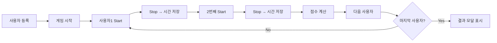

# 📄 PRD — 랜덤 스톱워치 게임 (가칭: Last Digit Game)

---

## 1. 📌 개요

**목적**
여러 사용자가 스톱워치를 활용하여 **랜덤성 기반 점수 경쟁**을 수행하는 웹 게임

**핵심 메커니즘**

* 각 사용자 2회 측정
* 각 측정값의 **초(second)의 끝자리 숫자 추출**
* 두 숫자를 곱하여 점수 산출
* 최고 점수 = 1등

---

## 2. 🎯 주요 기능

### 2.1 사용자 관리

* 최대 20명 참여
* 사용자 구성 요소:

    * 고유 ID
    * 이름 (가나다라… 자동 부여)
    * 랜덤 색상
    * 랜덤 단어 (20개 중 선택)

---

### 2.2 게임 흐름



---

### 2.3 스톱워치 기능

* 포맷: `mm:ss:SS` (분:초:밀리초 optional)
* Start / Stop 버튼
* 각 사용자별 **2회 기록 저장**

---

### 2.4 점수 계산 로직

```ts
function calculateScore(time1: string, time2: string): number {
  const sec1 = Number(time1.split(':')[2].slice(-1))
  const sec2 = Number(time2.split(':')[2].slice(-1))
  return sec1 * sec2
}
```

---

### 2.5 실시간 랭킹

* 사용자별 점수 계산 후 즉시 반영
* 정렬 기준:

    1. 점수 DESC
    2. 동일 점수 시 먼저 기록한 순

---

### 2.6 결과 모달

* 모든 사용자 완료 시 자동 표시
* 표시 정보:

    * 순위 (1등 ~ 꼴등)
    * 사용자 색상 강조
    * 점수
    * 시간 기록

---

## 3. 🧩 UI 구성

### 3.1 메인 영역

| 영역 | 설명              |
| -- | --------------- |
| 상단 | 전체 타이머          |
| 중앙 | 현재 플레이 사용자      |
| 하단 | Start / Stop 버튼 |

---

### 3.2 사용자 카드

* 색상 배경
* 이름 + 랜덤 단어
* 기록 시간 2개
* 점수 표시

---

### 3.3 랭킹 영역

* 실시간 업데이트
* Sticky or Sidebar 형태 추천

---

### 3.4 결과 모달

* 카드형 UI
* 애니메이션 포함 (순위 reveal)

---

## 4. 📊 데이터 모델

```ts
type User = {
  id: number
  name: string
  color: string
  label: string
  times: string[]
  score: number
  status: 'waiting' | 'playing' | 'done'
}
```

---

## 5. ⚙️ 상태 관리 설계

### 핵심 상태

```ts
{
  users: User[]
  currentUserIndex: number
  isRunning: boolean
  startTime: number | null
}
```

---

## 6. 🧠 핵심 로직

### 6.1 스톱워치

* `performance.now()` 기반 권장 (정밀도 ↑)

### 6.2 시간 포맷팅

```ts
function formatTime(ms: number) {
  const min = Math.floor(ms / 60000)
  const sec = Math.floor((ms % 60000) / 1000)
  const msPart = Math.floor((ms % 1000) / 10)
  return `${pad(min)}:${pad(sec)}:${pad(msPart)}`
}
```

---

## 7. 🎨 UX 요구사항

* 버튼 상태:

    * Start → Stop toggle
* 현재 플레이어 강조
* 완료 사용자 비활성화
* 랭킹 실시간 애니메이션 업데이트

게임이다 보니 너무 정적인 것 보다는 긴장감, 애니메이션, 효과 등을 넣어서 즐길수 있도록 만들어줘 

---

## 8. 🚨 예외 처리

* Start 중복 클릭 방지
* Stop 없이 다음 단계 이동 방지
* 사용자 미완료 시 결과 모달 차단

---

## 9. 📦 추천 라이브러리

### UI / 상태관리

* Nextjs


---

### 스타일

* Tailwind CSS → 빠른 UI 구축
* Motion → 랭킹/모달 애니메이션

---

### 유틸

* date-fns (날짜)
* native `performance.now()` (추천)

---

### 컴포넌트

* shadcn/ui → 모달, 카드
* https://magicui.design/docs/components 라이브러리 활용

---


## 11. 🔍 Evidence

* 확률 기반 게임 → 랜덤 요소 (끝자리 추출)
* 스톱워치 정확도 → `performance.now()` 일반적으로 권장
* React 기반 UI → 상태 관리 + 컴포넌트 분리 구조 표준


## ✅ 최종 결론

* 이 게임은 **“랜덤 + 반응속도 기반 경쟁 게임”**
* 핵심 포인트:

    1. **정확한 시간 측정**
    2. **끝자리 추출 로직**
    3. **실시간 랭킹 업데이트**
    4. **UX 피드백 (애니메이션, 강조)**
